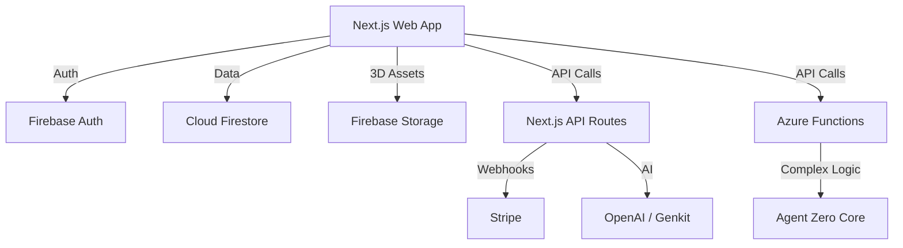

# 📘 LiTreeLab Unified Platform - Project Blueprint

**Version:** 2.0  
**Date:** 2026-02-07  
**Status:** Consolidation Phase  
**Author:** Trae (Assistant) for Kimi 2.5 (Implementation Agent)

---

## 1. Project Overview

*   **Project Title:** LiTreeLab Unified Platform ("One Unified Website")
*   **Project Goal:** To consolidate 12 disparate applications (AI, Metaverse, Trading, Payments, Social) into a single, cohesive, high-performance Next.js web application (`apps/web`). The goal is to eliminate context switching, unify authentication/billing, and provide a seamless "Super App" experience.
*   **Target Audience:**
    *   **Creators:** Using 3D tools and AI to generate content.
    *   **Traders:** Monitoring crypto markets and executing trades.
    *   **Developers:** Using the Agent Zero API and building on the platform.
    *   **Pro Users:** Subscribers accessing premium features.
*   **Key Features:**
    *   **Unified Auth:** Single Sign-On (SSO) via Firebase Auth for all modules.
    *   **Metaverse:** Interactive 3D environments (React Three Fiber) with avatars and social interaction.
    *   **AI Suite:** Genkit-powered RAG (Retrieval Augmented Generation), Chat with Agent Zero, and content generation.
    *   **Trading Dashboard:** Real-time crypto market data, charts, and portfolio tracking.
    *   **Marketplace:** Digital asset store for 3D models and plugins.
    *   **Payment System:** Stripe integration for subscriptions (Pro/Enterprise) and one-time purchases.
*   **Technology Stack (Proposed):**
    *   **Language:** TypeScript (Strict mode).
    *   **Frontend Framework:** Next.js 14 (App Router).
    *   **UI Library:** React 18, Tailwind CSS, Framer Motion, HeroUI/Radix UI.
    *   **3D Engine:** React Three Fiber (@react-three/fiber), Drei, Three.js.
    *   **Backend/Serverless:** Firebase (Functions, Firestore, Auth, Hosting), Azure Functions (Node.js v4).
    *   **Database:** Cloud Firestore (NoSQL).
    *   **AI:** Google Genkit, OpenAI SDK.
    *   **Payments:** Stripe SDK (Node.js & React).
    *   **Package Manager:** pnpm (Monorepo/Workspaces).

---

## 2. Functional Requirements

### User Stories
*   **Authentication:** "As a user, I want to log in once and access the Metaverse, AI Chat, and Trading dashboard without re-authenticating."
*   **Payments:** "As a free user, I want to upgrade to a Pro subscription using my credit card so that I can unlock advanced AI models and 3D assets."
*   **Metaverse:** "As a gamer, I want to customize my avatar's appearance and see other users moving in real-time."
*   **AI:** "As a researcher, I want to ask the AI questions about my uploaded documents (RAG) and get accurate citations."

### Use Cases
*   **Use Case 1: Premium Subscription Flow**
    1.  User navigates to `/pricing`.
    2.  User selects "Pro Plan" ($29/mo).
    3.  System redirects to Stripe Checkout (hosted).
    4.  User completes payment.
    5.  Stripe sends webhook to Firebase Cloud Function.
    6.  System updates User document in Firestore with `subscriptionStatus: 'active'`.
    7.  User is redirected back to `/dashboard` with unlocked features.

*   **Use Case 2: Metaverse Entry**
    1.  User clicks "Enter Studio" from Home.
    2.  System loads `MetaverseScene` (Canvas).
    3.  System initializes WebSocket/Socket.io connection for multiplayer sync.
    4.  User controls avatar via WASD keys.

### Input/Output Specifications
*   **AI Chat Input:** Text string (max 2000 chars) or File (PDF/TXT).
*   **AI Chat Output:** Streaming text response, optionally with code blocks or UI components.
*   **Trading Data Input:** WebSocket stream from exchange (Binance/Coinbase).
*   **Trading Data Output:** Real-time updated Candlestick Chart (OHLCV).

### Error Handling
*   **Global Error Boundary:** Catch React rendering errors and display a "Something went wrong" UI with a "Reload" button.
*   **API Errors:** Standardize 4xx/5xx responses. Show toast notifications (Sonner) for user-facing errors (e.g., "Payment Failed", "Network Error").
*   **Payment Failures:** Handle Stripe declines gracefully; prompt user to update payment method without losing session state.

---

## 3. Non-Functional Requirements

*   **Performance:**
    *   **Core Web Vitals:** LCP < 2.5s, FID < 100ms, CLS < 0.1.
    *   **3D Rendering:** Maintain 60 FPS on desktop, 30 FPS on high-end mobile.
    *   **Build Time:** < 5 minutes (currently optimized with caching).
*   **Security:**
    *   **Data:** Firestore Security Rules to prevent unauthorized access.
    *   **Secrets:** Never commit API keys; use `.env.local` and Firebase Secret Manager.
    *   **Payments:** PCI-DSS compliance via Stripe Elements/Checkout (no raw card data handling).
*   **Usability:**
    *   **Responsive:** Fully functional on Mobile (Touch controls for 3D) and Desktop.
    *   **Theme:** Dark mode by default ("Cyberpunk/Studio" aesthetic).
*   **Reliability:**
    *   **Offline Support:** Basic UI availability when offline; graceful degradation for live features.
*   **Maintainability:**
    *   **Code Structure:** Feature-based folders (`components/metaverse`, `components/trading`).
    *   **Types:** Shared TypeScript interfaces in `packages/core`.

---

## 4. Architecture Design

### System Architecture Diagram

### Component Breakdown
1.  **`apps/web` (The Core):**
    *   **`app/(auth)`**: Login, Register, Forgot Password.
    *   **`app/(dashboard)`**: Main user hub.
    *   **`components/3D`**: Reusable R3F components (Avatar, Scene, Lights).
    *   **`lib/firebase.ts`**: Singleton Firebase instance (Pinned to v10.13.0).
2.  **`api` (Backend):**
    *   **Azure Functions**: Handling heavy compute tasks for AI agents.
3.  **`packages/core`:**
    *   Shared zod schemas, utility functions, and constants.

### Data Model (Firestore)
*   **`users/{uid}`**:
    *   `email`: string
    *   `displayName`: string
    *   `photoURL`: string
    *   `subscription`: { `status`: 'active' | 'past_due', `planId`: string }
    *   `credits`: number
*   **`products/{id}`**: (Synced from Stripe)
    *   `name`: string
    *   `price`: number
    *   `currency`: string
*   **`scenes/{sceneId}`**:
    *   `name`: string
    *   `ownerId`: string
    *   `objects`: Array<{ `type`: string, `position`: [x,y,z], `rotation`: [x,y,z] }>

---

## 5. Technical Specifications

### Development Environment Setup
1.  **Install Node.js:** v20.17.0 (LTS).
2.  **Install pnpm:** `npm install -g pnpm@9`.
3.  **Clone Repo:** `git clone <repo-url>`.
4.  **Install Dependencies:** `pnpm install` (root).
5.  **Environment:** Copy `.env.example` to `.env.local`. Fill in `NEXT_PUBLIC_FIREBASE_Config` and `STRIPE_SECRET_KEY`.
6.  **Run Dev:** `pnpm dev` (starts web at localhost:3000).

### Coding Standards
*   **Style:** ESLint + Prettier (Next.js default config).
*   **Naming:** PascalCase for Components (`Avatar3D.tsx`), camelCase for functions (`calculateTax`), kebab-case for files (`user-profile.tsx`).
*   **State Management:**
    *   Global: React Context (Theme, Auth).
    *   Server State: TanStack Query (React Query).
    *   Local: `useState`, `useReducer`.

### Deployment Strategy
*   **Platform:** Firebase Hosting (Static + Edge).
*   **CI/CD:** GitHub Actions / GitLab CI.
    *   On Push to `main`: Lint -> Build -> Test -> Deploy Preview.
    *   On Tag: Deploy to Production.

---

## 6. Project Plan & Deliverables

### Phase 1: Build Stabilization (COMPLETED)
*   **Goal:** Ensure `apps/web` builds without errors.
*   **Deliverable:** Successful `pnpm build` on CI.

### Phase 2: Payment Migration (CRITICAL - NEXT STEP)
*   **Goal:** Move Stripe logic from `honey-comb-home` to `apps/web`.
*   **Tasks:**
    1.  Copy `stripe-config.js` logic to `web/src/lib/stripe.ts`.
    2.  Migrate Firebase Functions (`onCreateCheckoutSession`, `stripeWebhook`) to `apps/web/app/api/stripe/route.ts` (Next.js API Routes preferred for simplicity) OR keep in `functions/`.
    3.  Create `PricingPage.tsx` in `web`.
*   **Deliverable:** Working "Upgrade" button in Web App.

### Phase 3: AI & Metaverse Merge
*   **Goal:** Port features from `litlabs` and `genkit-rag`.
*   **Tasks:**
    1.  Copy `MetaverseScene.tsx` and assets.
    2.  Copy Genkit RAG flows.
*   **Deliverable:** `/metaverse` and `/chat` routes active in Web App.

---

## 7. UI/UX Design (Conceptual)

*   **Layout:**
    *   **Sidebar:** Navigation (Home, Chat, Studio, Trade, Settings). Collapsible.
    *   **Header:** User Profile, Notifications, Wallet Balance, "Upgrade" CTA.
    *   **Main Content:** Dynamic area (Grid for Dashboard, Canvas for Metaverse).
*   **Branding:**
    *   **Colors:** `lab-dark` (#03030a), `lab-green` (#22c55e), `lab-purple` (#7c3aed), `studio-sand` (#f5d56e).
    *   **Typography:** Sans-serif (Inter/Geist) for UI, Monospace for code/data.

---

## 8. Future Considerations

*   **Scalability:**
    *   Move heavy AI processing to dedicated Python microservices (FastAPI) if Node.js becomes a bottleneck.
    *   Use Firebase App Check to prevent abuse.
*   **Mobile App:**
    *   Wrap `apps/web` in Capacitor/Ionic for iOS/Android release using the same codebase.
