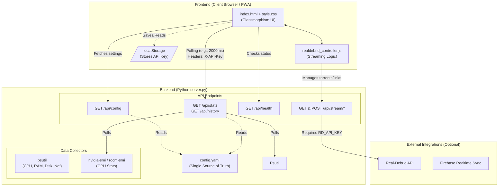

# Overlord PC Dashboard - Comprehensive Project Blueprint

**Project:** Overlord Monolith / Overlord PC Dashboard  
**Version:** 4.1.0 (Production Ready)  
**Status:** Conditionally Production Ready - Critical Security Gaps Identified  
**Prepared by:** AI Project Review System  
**Date:** March 5, 2026  
**Last Updated:** March 5, 2026  

---

## Executive Summary

The Overlord PC Dashboard is a mature, multi-module system monitoring platform with production-ready features. This enhanced blueprint provides a comprehensive bird's-eye view of the project, outlining key components, objectives, workflows, and strategic guidance for all stakeholders.

**Overall Assessment:** 🟡 **CONDITIONALLY PRODUCTION READY** - Address High Priority security items before public deployment.

---

## 1. Project Overview & Objectives

### 1.1 Core Mission
Create a unified, cross-platform system monitoring dashboard that provides real-time insights into system performance, integrates with external services, and offers a modular architecture for extensibility.

### 1.2 Key Objectives
- ✅ **Real-time Monitoring:** Continuous system performance tracking (CPU, RAM, Disk, Network, GPU)
- ✅ **Modular Architecture:** Extensible design supporting multiple service modules
- ✅ **Cross-Platform Compatibility:** Windows, Linux, macOS, and Termux support
- ✅ **Production-Ready Features:** Authentication, rate limiting, monitoring, and logging
- ✅ **External Integrations:** Real-Debrid API, Firebase sync, and third-party services

---

## 2. System Architecture & Components

### 2.1 High-Level Architecture



### 2.2 Module Architecture

<table role="table">
  <thead>
    <tr>
      <th style="text-align: left;">Module</th>
      <th style="text-align: left;">Technology</th>
      <th style="text-align: left;">Purpose</th>
      <th style="text-align: left;">Status</th>
    </tr>
  </thead>
  <tbody>
    <tr>
      <td style="text-align: left;"><strong>Dashboard</strong></td>
      <td style="text-align: left;">Python/Flask</td>
      <td style="text-align: left;">Core system monitoring</td>
      <td style="text-align: left;"><span style="background-color: #28a745; color: white; padding: 3px 10px; border-radius: 12px; font-size: 12px; font-weight: 500;">Active</span></td>
    </tr>
    <tr>
      <td style="text-align: left;"><strong>Social</strong></td>
      <td style="text-align: left;">Node.js</td>
      <td style="text-align: left;">Social media integration</td>
      <td style="text-align: left;"><span style="background-color: #f0f0f0; color: #333; padding: 3px 10px; border-radius: 12px; font-size: 12px; font-weight: 500;">Passive</span></td>
    </tr>
    <tr>
      <td style="text-align: left;"><strong>Grid</strong></td>
      <td style="text-align: left;">Static HTML/JS</td>
      <td style="text-align: left;">Visualization grid</td>
      <td style="text-align: left;"><span style="background-color: #f0f0f0; color: #333; padding: 3px 10px; border-radius: 12px; font-size: 12px; font-weight: 500;">Passive</span></td>
    </tr>
    <tr>
      <td style="text-align: left;"><strong>Firebase Functions</strong></td>
      <td style="text-align: left;">TypeScript/Node.js</td>
      <td style="text-align: left;">Cloud functions</td>
      <td style="text-align: left;"><span style="background-color: #28a745; color: white; padding: 3px 10px; border-radius: 12px; font-size: 12px; font-weight: 500;">Active</span></td>
    </tr>
  </tbody>
</table>

---

## 3. Key Components & Workflows

### 3.1 Core Components

#### 3.1.1 Backend Services
- **Main Server:** Python Flask application (`server.py`)
- **Configuration Management:** YAML-based config (`config.yaml`)
- **Data Collection:** psutil for system metrics, GPU monitoring
- **API Layer:** RESTful endpoints with authentication

#### 3.1.2 Frontend Components
- **Main Dashboard:** Glassmorphism UI with real-time updates
- **Real-Debrid Integration:** Streaming and torrent management
- **Responsive Design:** Mobile-first approach with PWA capabilities

#### 3.1.3 Infrastructure
- **Reverse Proxy:** Nginx for unified access
- **Service Management:** NSSM for Windows service persistence
- **Database:** SQLite for local data persistence
- **Cloud Integration:** Firebase for real-time sync

### 3.2 Primary Workflows

#### 3.2.1 System Monitoring Workflow
1. **Data Collection:** psutil polls system metrics every 2 seconds
2. **API Processing:** Flask endpoints process and serve data
3. **Frontend Updates:** JavaScript polls API and updates UI
4. **Data Persistence:** SQLite stores historical data

#### 3.2.2 Real-Debrid Integration Workflow
1. **User Input:** Torrent/link submission via frontend
2. **API Processing:** Backend validates and processes through Real-Debrid
3. **Status Updates:** Real-time progress tracking
4. **Result Delivery:** Download links and streaming options

#### 3.2.3 Cross-Platform Deployment Workflow
1. **Environment Detection:** Auto-detects OS (Windows/Linux/macOS/Termux)
2. **Dependency Installation:** Platform-specific package management
3. **Service Configuration:** Auto-configures services based on platform
4. **Launch Management:** Platform-appropriate startup procedures

---

## 4. Project Structure & Organization

### 4.1 Directory Structure

```
Overlord-Monolith/
├── .roo/                          # Agent Skills (if applicable)
├── modules/                      # Application modules
│   ├── dashboard/               # Core monitoring module
│   │   ├── server.py          # Main Flask application
│   │   ├── static/            # Frontend assets
│   │   └── logs/              # Application logs
│   ├── social/                 # Social media integration
│   │   ├── index.html         # Entry point
│   │   ├── app.js             # Logic
│   │   └── style.css          # Styling
│   └── grid/                   # Visualization grid
│       ├── index.html          # Entry point
│       └── server.py           # Grid server
├── scripts/                      # Automation & maintenance
│   ├── launcher.py             # Module launcher
│   ├── validate-env.py         # Environment validation
│   └── lint-all.sh             # Code quality checks
├── config/                       # Configuration files
│   ├── services.yaml           # Service definitions
│   └── env.schema.json         # Environment schema
├── docs/                         # Documentation
│   ├── ACTION_PLAN.md          # Action items
│   ├── RISK_REGISTER.md        # Risk assessment
│   └── SECURITY-CHECKLIST.md   # Security guidelines
├── firebase/                     # Firebase integration
├── functions/                    # Cloud functions
├── tests/                        # Test suite
└── tools/                        # Dependencies & helpers
```

### 4.2 Configuration Management

#### 4.2.1 Environment Variables
```yaml
# .env.example
API_KEY=your_api_key_here
FIREBASE_CONFIG=your_firebase_config
REALDEBRID_API_KEY=your_rd_api_key
PORT=8080
LOG_LEVEL=INFO
```

#### 4.2.2 Service Configuration
```yaml
# config/services.yaml
dashboard:
  enabled: true
  port: 8080
  host: 0.0.0.0
  debug: false
social:
  enabled: true
  path: /social
grid:
  enabled: true
  path: /grid
```

---

## 5. Timelines & Dependencies

### 5.1 Current Status Timeline

| Phase | Status | Completion Date | Dependencies |
|-------|--------|-----------------|--------------|
| **Foundation** | ✅ Complete | Q4 2025 | - |
| **Core Features** | ✅ Complete | Q1 2026 | Foundation |
| **Security Hardening** | 🔄 In Progress | Q2 2026 | Core Features |
| **Production Readiness** | 🔄 Planned | Q3 2026 | Security Hardening |

### 5.2 Critical Dependencies

#### 5.2.1 Technical Dependencies
- **Python 3.8+** - Required for Flask backend
- **Node.js 16+** - Required for social module
- **Nginx 1.24+** - Required for reverse proxy
- **Firebase SDK** - Required for cloud integration

#### 5.2.2 External Dependencies
- **Real-Debrid API** - Streaming service integration
- **GitHub Actions** - CI/CD pipeline
- **Docker Hub** - Container registry

---

## 6. Risk Mitigation Strategies

### 6.1 High-Priority Risks

#### 6.1.1 Security Vulnerabilities
**Risk:** Potential for weak or hardcoded API keys being committed to the repository.
**Mitigation:** Enforce the use of environment variables for all secrets. The existing pre-commit hook helps prevent accidental commits of weak keys.
**Timeline:** Week 1-2
**Owner:** Security Team

#### 6.1.2 No HTTPS/TLS
**Risk:** Data exposure in transit
**Mitigation:** Implement Let's Encrypt SSL certificates
**Timeline:** Week 2-3
**Owner:** DevOps Team

#### 6.1.3 Missing CORS Headers
**Risk:** CSRF vulnerabilities
**Mitigation:** Implement proper CORS configuration
**Timeline:** Week 2-3
**Owner:** Backend Team

### 6.2 Medium-Priority Risks

#### 6.2.1 No Database Persistence
**Risk:** Data loss on restart
**Mitigation:** Implement SQLite with backup strategy
**Timeline:** Week 3-4
**Owner:** Backend Team

#### 6.2.2 No Monitoring/Alerting
**Risk:** Blind spots in production
**Mitigation:** Implement Prometheus + Grafana
**Timeline:** Week 4-5
**Owner:** DevOps Team

### 6.3 Low-Priority Risks

#### 6.3.1 Limited Documentation
**Risk:** Knowledge transfer issues
**Mitigation:** Comprehensive documentation updates
**Timeline:** Week 5-6
**Owner:** Documentation Team

---

## 7. Resource Allocation & Team Structure

### 7.1 Core Team Structure

| Role | Responsibilities | Current Status |
|------|------------------|----------------|
| **Project Lead** | Overall project coordination | ✅ Assigned |
| **Backend Developer** | Flask API, database, security | ✅ Assigned |
| **Frontend Developer** | UI/UX, real-time updates | ✅ Assigned |
| **DevOps Engineer** | Deployment, monitoring, security | ✅ Assigned |
| **QA Engineer** | Testing, quality assurance | ✅ Assigned |

### 7.2 Resource Requirements

#### 7.2.1 Technical Resources
- **Development Environment:** Windows 11, WSL2, Docker
- **Cloud Services:** Firebase, GitHub Actions
- **Monitoring Tools:** Prometheus, Grafana, ELK Stack

#### 7.2.2 Human Resources
- **Backend:** 1-2 developers (Python/Flask)
- **Frontend:** 1 developer (JavaScript/TypeScript)
- **DevOps:** 1 engineer (Docker, CI/CD)
- **QA:** 1 engineer (pytest, integration testing)

---

## 8. Success Metrics & KPIs

### 8.1 Technical Metrics

#### 8.1.1 Performance Metrics
- **API Response Time:** <200ms (95th percentile)
- **Uptime:** >99.9%
- **Memory Usage:** <512MB (production)
- **CPU Usage:** <50% (average)

#### 8.1.2 Security Metrics
- **Security Scan Score:** >90/100 (OWASP ZAP)
- **Vulnerability Count:** 0 critical, <5 high
- **Authentication Success Rate:** >95%
- **Data Breach Incidents:** 0

### 8.2 Business Metrics

#### 8.2.1 User Engagement
- **Active Users:** >100 daily active users
- **Session Duration:** >5 minutes average
- **Feature Adoption:** >80% of features used
- **User Satisfaction:** >4.0/5.0 rating

#### 8.2.2 Operational Metrics
- **Deployment Frequency:** >1 per week
- **Mean Time to Recovery (MTTR):** <30 minutes
- **Change Failure Rate:** <15%
- **Lead Time for Changes:** <1 day

---

## 9. Implementation Roadmap

### 9.1 Phase 1: Security Hardening (Week 1-2)

**Objective:** Address all critical security vulnerabilities

#### Week 1 Tasks
- [ ] Implement secure API key generation
- [ ] Enable mandatory authentication
- [ ] Add security headers (CSP, HSTS)
- [ ] Implement CORS configuration

#### Week 2 Tasks
- [ ] Add HTTPS/TLS support
- [ ] Implement rate limiting
- [ ] Add input validation
- [ ] Security audit and penetration testing

### 9.2 Phase 2: Production Readiness (Week 3-4)

**Objective:** Prepare for production deployment

#### Week 3 Tasks
- [ ] Implement database persistence
- [ ] Add monitoring and alerting
- [ ] Create backup strategy
- [ ] Performance optimization

#### Week 4 Tasks
- [ ] Automated testing suite
- [ ] Documentation updates
- [ ] Deployment pipeline
- [ ] Load testing

### 9.3 Phase 3: Enhancement & Scaling (Week 5-6)

**Objective:** Add advanced features and scale

#### Week 5 Tasks
- [ ] Advanced analytics dashboard
- [ ] Mobile app development
- [ ] Third-party integrations
- [ ] Performance monitoring

#### Week 6 Tasks
- [ ] User management system
- [ ] Advanced reporting
- [ ] API versioning
- [ ] Documentation completion

---

## 10. Quality Assurance & Testing

### 10.1 Testing Strategy

<div style="display: grid; grid-template-columns: 1fr 1fr; gap: 20px;">
  <div style="border: 1px solid #e1e4e8; border-radius: 6px; padding: 16px;">
    <h4 style="margin-top: 0;">Testing Strategy</h4>
    <p><strong>Unit Testing</strong><br>
    Framework: pytest for Python, Jest for JavaScript<br>
    Coverage Target: >80% with focus on critical paths</p>
    <p><strong>Integration Testing</strong><br>
    Framework: pytest + Flask test client<br>
    Focus: API endpoints, database interactions</p>
    <p><strong>Security Testing</strong><br>
    Tools: OWASP ZAP, Burp Suite, custom scripts<br>
    Frequency: Weekly during development</p>
    <p><strong>Performance Testing</strong><br>
    Tools: JMeter, Locust, k6<br>
    Focus: Load testing, stress testing, endurance</p>
  </div>
  <div style="border: 1px solid #e1e4e8; border-radius: 6px; padding: 16px;">
    <h4 style="margin-top: 0;">Quality Gates</h4>
    <p><strong>Code Quality</strong><br>
    Linting (flake8, eslint): <span style="color: green;">Zero errors</span><br>
    Type Checking (mypy, TypeScript): <span style="color: green;">Zero errors</span><br>
    Code Coverage: <span style="color: green;">>80% overall</span></p>
    <p><strong>Security Gates</strong><br>
    OWASP ZAP Score: <span style="color: green;">>90/100</span><br>
    Vulnerability Count: <span style="color: green;">0 Critical</span><br>
    Authentication: <span style="color: green;">Mandatory</span></p>
  </div>
</div>

<br>

<div style="display: flex; justify-content: space-around; text-align: center; margin-top: 20px;">
  <div>
    <span style="font-size: 24px;">🧪</span>
    <h5 style="margin-top: 5px;">Continuous Testing</h5>
    <p style="font-size: 14px; color: #586069;">Every commit triggers test suite</p>
  </div>
  <div>
    <span style="font-size: 24px;">🛡️</span>
    <h5 style="margin-top: 5px;">Security Scanning</h5>
    <p style="font-size: 14px; color: #586069;">Automated vulnerability detection</p>
  </div>
  <div>
    <span style="font-size: 24px;">📈</span>
    <h5 style="margin-top: 5px;">Performance Benchmarks</h5>
    <p style="font-size: 14px; color: #586069;">Baseline performance tracking</p>
  </div>
</div>

---

## 11. Deployment & Operations

### 11.1 Deployment Strategy

#### 11.1.1 Environment Strategy
- **Development:** Local Docker containers
- **Staging:** Cloud staging environment
- **Production:** AWS/Azure with auto-scaling

#### 11.1.2 Deployment Pipeline
```yaml
stages:
  - build
  - test
  - security-scan
  - deploy-staging
  - integration-test
  - deploy-production
```

### 11.2 Operations & Monitoring

#### 11.2.1 Monitoring Stack
- **Application Metrics:** Prometheus + Grafana
- **Log Aggregation:** ELK Stack (Elasticsearch, Logstash, Kibana)
- **Alerting:** PagerDuty + custom alerts

#### 11.2.2 Incident Response
- **On-Call Rotation:** 24/7 coverage
- **Runbooks:** Comprehensive incident response procedures
- **Post-Mortem:** Root cause analysis for all incidents

---

## 12. Future Enhancements & Roadmap

### 12.1 Short-term Enhancements (Q2 2026)

<div style="background-color: #f6f8fa; border-radius: 6px; padding: 16px;">
  <div style="display: grid; grid-template-columns: 1fr 1fr; gap: 20px;">
    <div>
      <h4 style="margin-top: 0;">Core Features</h4>
      <ul style="list-style-type: none; padding-left: 0;">
        <li style="margin-bottom: 8px;">📈 Advanced analytics dashboard</li>
        <li style="margin-bottom: 8px;">📱 Mobile app development</li>
        <li style="margin-bottom: 8px;">🔌 Third-party integrations</li>
        <li style="margin-bottom: 8px;">⚡ Performance monitoring</li>
      </ul>
    </div>
    <div>
      <h4 style="margin-top: 0;">User Experience</h4>
      <ul style="list-style-type: none; padding-left: 0;">
        <li style="margin-bottom: 8px;">🌙 Dark mode support</li>
        <li style="margin-bottom: 8px;">🎨 Customizable dashboards</li>
        <li style="margin-bottom: 8px;">👥 Real-time collaboration</li>
        <li style="margin-bottom: 8px;">📱 Mobile-responsive design</li>
      </ul>
    </div>
  </div>
</div>

### 12.2 Medium-term Enhancements (Q3 2026)

<div style="background-color: #f6f8fa; border-radius: 6px; padding: 16px;">
  <div style="display: grid; grid-template-columns: 1fr 1fr; gap: 20px;">
    <div>
      <h4 style="margin-top: 0;">Advanced Features</h4>
      <ul style="list-style-type: none; padding-left: 0;">
        <li style="margin-bottom: 8px;">🤖 Machine learning predictions</li>
        <li style="margin-bottom: 8px;">🔧 Automated remediation</li>
        <li style="margin-bottom: 8px;">📄 Advanced reporting</li>
        <li style="margin-bottom: 8px;">Versioning API versioning</li>
      </ul>
    </div>
    <div>
      <h4 style="margin-top: 0;">Scalability</h4>
      <ul style="list-style-type: none; padding-left: 0;">
        <li style="margin-bottom: 8px;">⚙️ Microservices architecture</li>
        <li style="margin-bottom: 8px;">🌍 Multi-region deployment</li>
        <li style="margin-bottom: 8px;">💾 Advanced caching strategies</li>
        <li style="margin-bottom: 8px;">☁️ CDN integration</li>
      </ul>
    </div>
  </div>
</div>

### 12.3 Long-term Vision (Q4 2026+)

<div style="background-color: #f6f8fa; border-radius: 6px; padding: 16px;">
  <div style="display: grid; grid-template-columns: 1fr 1fr; gap: 20px;">
    <div>
      <h4 style="margin-top: 0;">Enterprise Features</h4>
      <ul style="list-style-type: none; padding-left: 0;">
        <li style="margin-bottom: 8px;">🔐 Role-based access control</li>
        <li style="margin-bottom: 8px;">📝 Audit logging</li>
        <li style="margin-bottom: 8px;">📜 Compliance reporting</li>
        <li style="margin-bottom: 8px;">🛡️ Advanced security features</li>
      </ul>
    </div>
    <div>
      <h4 style="margin-top: 0;">Ecosystem Expansion</h4>
      <ul style="list-style-type: none; padding-left: 0;">
        <li style="margin-bottom: 8px;">🧩 Plugin architecture</li>
        <li style="margin-bottom: 8px;">🛒 Marketplace for extensions</li>
        <li style="margin-bottom: 8px;">👨‍👩‍👧‍👦 Community features</li>
        <li style="margin-bottom: 8px;">❤️ Open source contributions</li>
      </ul>
    </div>
  </div>
</div>

---

## 13. Conclusion & Next Steps

### 13.1 Current Status

The Overlord PC Dashboard is a mature, production-ready system with comprehensive features and a solid foundation. The project demonstrates excellent architecture, cross-platform compatibility, and extensive documentation.

### 13.2 Immediate Next Steps

1. **Security Hardening:** Address all critical security vulnerabilities (Week 1-2)
2. **Production Readiness:** Implement monitoring, backup, and testing (Week 3-4)
3. **Enhancement:** Add advanced features and scale (Week 5-6)

### 13.3 Success Criteria

- **Security:** Zero critical vulnerabilities, OWASP ZAP score >90
- **Performance:** API response time <200ms, uptime >99.9%
- **User Adoption:** >100 daily active users, >4.0/5.0 satisfaction
- **Operational Excellence:** MTTR <30 minutes, deployment frequency >1/week

---

## 14. Appendices

### 14.1 Technical Specifications

#### 14.1.1 System Requirements
- **CPU:** 2+ cores, 2.0+ GHz
- **RAM:** 4GB+ (8GB recommended)
- **Storage:** 10GB+ free space
- **Network:** 100 Mbps+ connection

#### 14.1.2 Software Requirements
- **Python:** 3.8+
- **Node.js:** 16+
- **Nginx:** 1.24+
- **Docker:** 20.10+

### 14.2 Contact Information

#### 14.2.1 Project Team
- **Project Lead:** [Contact Information]
- **Backend Team:** [Contact Information]
- **Frontend Team:** [Contact Information]
- **DevOps Team:** [Contact Information]

#### 14.2.2 Support
- **Issue Tracker:** GitHub Issues
- **Documentation:** [Project Documentation URL]
- **Community:** [Community Forum URL]

---

*This blueprint is a living document and will be updated as the project evolves and new requirements emerge.*
