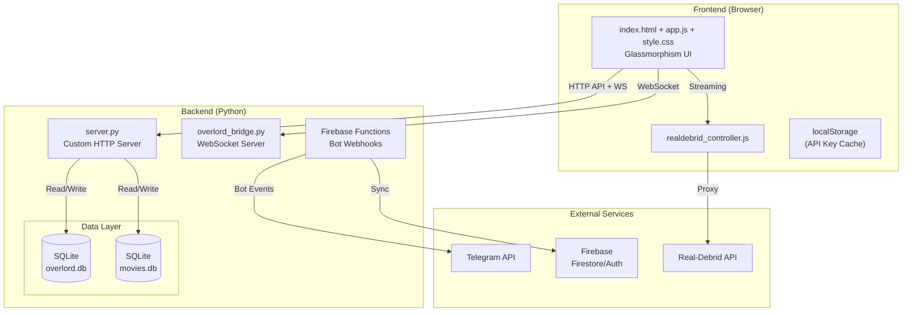

# Overlord PC Dashboard — Development Handbook

> **Version:** 4.2.1  
> **Last Updated:** 2026-03-06  
> **Maintainer:** @litre

---

## Table of Contents

1. [Overview](#1-overview)
2. [Architecture](#2-architecture)
3. [Tech Stack](#3-tech-stack)
4. [Project Structure](#4-project-structure)
5. [Frontend Development](#5-frontend-development)
6. [Backend Development](#6-backend-development)
7. [Database](#7-database)
8. [API Design](#8-api-design)
9. [Security](#9-security)
10. [Testing](#10-testing)
11. [Deployment](#11-deployment)
12. [Debugging](#12-debugging)
13. [Migration to Modern Stack](#13-migration-to-modern-stack)

---

## 1. Overview

The **Overlord PC Dashboard** is a real-time system monitoring dashboard with the following capabilities:

- **System Monitoring:** CPU, RAM, Disk, GPU, Network stats
- **Historical Data:** SQLite persistence with retention policies
- **Streaming Integration:** Real-Debrid API for media streaming
- **Bot Integration:** Telegram bot for remote commands
- **Real-time Communication:** WebSocket bridge for live updates
- **Security:** API key authentication, rate limiting, CSP headers
- **Multi-platform:** Windows, Linux, Termux (Android) support

---

## 2. Architecture



---

## 3. Tech Stack

### Frontend
| Technology | Version | Purpose |
|------------|---------|---------|
| Vanilla JavaScript | ES2022 | Core application logic |
| React | 18.x (prod build) | UI components (loaded via CDN) |
| Recharts | Latest | Data visualization |
| CSS3 | - | Glassmorphism styling |
| localStorage | - | Client-side state |

### Backend
| Technology | Version | Purpose |
|------------|---------|---------|
| Python | 3.12+ | Server runtime |
| http.server | stdlib | HTTP request handling |
| websockets | 12.x | WebSocket communication |
| psutil | 6.x | System metrics collection |
| SQLite3 | 3.35+ | Data persistence |
| PyYAML | 6.x | Configuration management |

### Infrastructure
| Technology | Purpose |
|------------|---------|
| Firebase Functions | Serverless bot webhooks |
| Firestore | Cloud data sync |
| Vercel | Frontend hosting |
| PowerShell | Windows automation |
| Termux | Android deployment |

---

## 4. Project Structure

```
Overlord-Pc-Dashboard/
├── 📁 Root Configuration
│   ├── .env.example              # Environment variable template
│   ├── config.yaml               # Server configuration
│   ├── firebase.json             # Firebase hosting config
│   └── vercel.json               # Vercel deployment config
│
├── 📁 Frontend
│   ├── index.html                # Main dashboard UI
│   ├── home.html                 # Landing page
│   ├── app.js                    # Core application logic
│   ├── style.css                 # Glassmorphism styles
│   ├── realdebrid_controller.js  # Streaming integration
│   └── js/
│       ├── firebase-config.js    # Firebase initialization
│       ├── react*.js             # React CDN bundles
│       └── Recharts.js           # Charting library
│
├── 📁 Backend
│   ├── server.py                 # Main HTTP server (v4.2.1)
│   ├── overlord_bridge.py        # WebSocket bridge server
│   └── scripts/
│       ├── wallpaper_gen.py      # Wallpaper generation
│       └── *.ps1                 # PowerShell automation
│
├── 📁 Firebase Functions
│   └── functions/
│       ├── index.js              # Cloud Functions entry
│       ├── auth-login.js         # Auth handlers
│       └── botWebhook/           # Bot integration
│
├── 📁 Database
│   ├── overlord.db               # System metrics (SQLite)
│   └── movies.db                 # Media library (SQLite)
│
├── 📁 Configuration
│   ├── config.yaml               # Server settings
│   └── .env                      # Environment secrets
│
├── 📁 Overlord Dashboard (Subproject)
│   └── overlord-dashboard/
│       ├── dashboard/            # Flask-based dashboard
│       ├── requirements.txt      # Python deps
│       └── .venv/                # Virtual environment
│
└── 📁 Documentation
    ├── ARCHITECTURE.md
    ├── DEVELOPMENT_HANDBOOK.md   # This file
    ├── SECURITY_AUDIT_REPORT.md
    └── *.md                      # Various guides
```

---

## 5. Frontend Development

### 5.1 Component Architecture

The frontend uses a **modular vanilla JS pattern** with React for specific components:

```javascript
// Core modules in app.js
const OverlordApp = {
    // State management
    state: {
        apiKey: localStorage.getItem('apiKey'),
        refreshInterval: 5000,
        stats: null,
        history: []
    },
    
    // Initialization
    init() {
        this.bindEvents();
        this.startPolling();
        this.initCharts();
    },
    
    // API Communication
    async fetchStats() {
        const res = await fetch('/api/stats', {
            headers: { 'X-API-Key': this.state.apiKey }
        });
        return res.json();
    },
    
    // UI Updates
    updateUI(data) {
        // DOM manipulation
    }
};
```

### 5.2 Glassmorphism Design System

```css
/* Core glassmorphism pattern from style.css */
.glass-panel {
    background: rgba(30, 30, 47, 0.7);
    backdrop-filter: blur(12px);
    -webkit-backdrop-filter: blur(12px);
    border: 1px solid rgba(255, 255, 255, 0.1);
    border-radius: 16px;
    box-shadow: 0 8px 32px rgba(0, 0, 0, 0.3);
}

.neon-text {
    text-shadow: 
        0 0 5px rgba(0, 255, 255, 0.5),
        0 0 10px rgba(0, 255, 255, 0.3);
}
```

### 5.3 State Management

Uses **localStorage** for persistence:

```javascript
// Save API key
localStorage.setItem('apiKey', apiKey);

// Configuration cache
const config = JSON.parse(localStorage.getItem('config') || '{}');
```

---

## 6. Backend Development

### 6.1 Custom HTTP Server

The server extends `http.server.BaseHTTPRequestHandler`:

```python
class OverlordHandler(BaseHTTPRequestHandler):
    """Custom HTTP handler with routing, auth, and rate limiting."""
    
    def do_GET(self):
        """Handle GET requests."""
        path = urlparse(self.path).path
        
        # Route dispatch
        routes = {
            '/api/stats': self.handle_stats,
            '/api/health': self.handle_health,
            '/api/config': self.handle_config,
        }
        
        handler = routes.get(path, self.handle_static)
        handler()
    
    def check_auth(self):
        """Validate API key from header."""
        api_key = self.headers.get('X-API-Key')
        return api_key == CONFIG['auth']['api_key']
```

### 6.2 WebSocket Bridge

Real-time communication via `overlord_bridge.py`:

```python
async def handler(websocket, path):
    """WebSocket connection handler."""
    # Auth first
    auth = await websocket.recv()
    if auth.strip() != AUTH_TOKEN:
        await websocket.close(1008, "Auth failed")
        return
    
    # Command loop
    async for message in websocket:
        data = json.loads(message)
        await process_command(data, websocket)
```

### 6.3 System Metrics Collection

```python
def get_system_stats():
    """Collect system metrics using psutil."""
    return {
        'cpu': {
            'percent': psutil.cpu_percent(interval=0.1),
            'count': psutil.cpu_count(),
            'freq': psutil.cpu_freq()._asdict() if psutil.cpu_freq() else None
        },
        'memory': psutil.virtual_memory()._asdict(),
        'disk': psutil.disk_usage('/')._asdict(),
        'network': psutil.net_io_counters()._asdict(),
        'gpu': get_gpu_stats(),  # nvidia-smi or rocm-smi
        'timestamp': datetime.now().isoformat()
    }
```

---

## 7. Database

### 7.1 SQLite Schema

```sql
-- System metrics table
CREATE TABLE IF NOT EXISTS system_stats (
    id INTEGER PRIMARY KEY AUTOINCREMENT,
    timestamp DATETIME DEFAULT CURRENT_TIMESTAMP,
    cpu_percent REAL,
    memory_percent REAL,
    memory_used_gb REAL,
    memory_total_gb REAL,
    disk_percent REAL,
    disk_used_gb REAL,
    disk_total_gb REAL,
    network_sent_mb REAL,
    network_recv_mb REAL,
    gpu_percent REAL,
    gpu_memory_percent REAL,
    temperature_c REAL
);

-- Historical aggregation (hourly)
CREATE TABLE IF NOT EXISTS hourly_stats (
    hour DATETIME PRIMARY KEY,
    avg_cpu REAL,
    max_cpu REAL,
    avg_memory REAL,
    max_memory REAL
);
```

### 7.2 Data Retention

```python
def cleanup_old_data(retention_days=30):
    """Remove data older than retention period."""
    cutoff = datetime.now() - timedelta(days=retention_days)
    cursor.execute(
        "DELETE FROM system_stats WHERE timestamp < ?",
        (cutcutoff.isoformat(),)
    )
```

---

## 8. API Design

### 8.1 REST Endpoints

| Method | Endpoint | Auth | Description |
|--------|----------|------|-------------|
| GET | `/api/health` | No | Health check |
| GET | `/api/config` | Yes | Get configuration |
| GET | `/api/stats` | Yes | Current system stats |
| GET | `/api/history` | Yes | Historical data |
| POST | `/api/stream/add` | Yes | Add Real-Debrid link |
| GET | `/api/stream/status` | Yes | Check stream status |
| WS | `ws://localhost:8765` | Token | Real-time bridge |

### 8.2 Response Format

```json
{
    "success": true,
    "data": { ... },
    "timestamp": "2026-03-06T01:16:51.534315",
    "version": "4.2.1"
}
```

### 8.3 Error Handling

```json
{
    "success": false,
    "error": {
        "code": "RATE_LIMITED",
        "message": "Too many requests",
        "retry_after": 60
    }
}
```

---

## 9. Security

### 9.1 Authentication

```python
# API Key validation
def check_auth(headers):
    api_key = headers.get('X-API-Key')
    return secrets.compare_digest(api_key, CONFIG['auth']['api_key'])
```

### 9.2 Rate Limiting

```python
# Token bucket algorithm
class RateLimiter:
    def __init__(self, rps=10, burst=20):
        self.tokens = burst
        self.last_update = time.time()
        self.rps = rps
    
    def allow_request(self):
        now = time.time()
        elapsed = now - self.last_update
        self.tokens = min(self.burst, self.tokens + elapsed * self.rps)
        
        if self.tokens >= 1:
            self.tokens -= 1
            return True
        return False
```

### 9.3 Security Headers

```python
SECURITY_HEADERS = {
    'X-Content-Type-Options': 'nosniff',
    'X-Frame-Options': 'DENY',
    'X-XSS-Protection': '1; mode=block',
    'Content-Security-Policy': "default-src 'self'",
    'Referrer-Policy': 'strict-origin-when-cross-origin'
}
```

---

## 10. Testing

### 10.1 Manual Testing

```bash
# Start server
python server.py

# Test health endpoint
curl http://localhost:8080/api/health

# Test with auth
curl -H "X-API-Key: your-key" http://localhost:8080/api/stats

# Test WebSocket
wscat -c ws://localhost:8765
> OVERLORD-LOCAL-TOKEN-2026
```

### 10.2 PowerShell Testing

```powershell
# Windows-specific tests
./scripts/test-server.ps1
./scripts/test-bridge.ps1
```

---

## 11. Deployment

### 11.1 Local Development

```powershell
# Windows
.\start-overlord.ps1

# Or manually
python server.py &
python scripts/overlord_bridge.py &
```

### 11.2 Firebase Deployment

```powershell
cd functions
npm install
firebase deploy --only functions
```

### 11.3 Vercel Deployment

```bash
vercel --prod
```

---

## 12. Debugging

### 12.1 Server Logs

```python
# Structured logging
logging.basicConfig(
    level=logging.INFO,
    format='%(asctime)s - %(name)s - %(levelname)s - %(message)s',
    handlers=[
        logging.FileHandler('overlord.log'),
        logging.StreamHandler()
    ]
)
```

### 12.2 Common Issues

| Issue | Solution |
|-------|----------|
| Port 8080 in use | Change in config.yaml or use get_free_port() |
| WebSocket auth fail | Check OVERLORD_AUTH_TOKEN env var |
| SQLite locked | Close other connections, check file permissions |
| GPU stats missing | Install nvidia-smi or rocm-smi |

### 12.3 Debug Mode

```python
# Enable debug logging
LOGGING['level'] = 'DEBUG'

# Enable verbose WebSocket logging
websocket.enableTrace(True)
```

---

## 13. Migration to Modern Stack

See [MIGRATION_PLAN.md](./MIGRATION_PLAN.md) for detailed roadmap to:

- **Frontend:** React 18 + TypeScript + Vite
- **Backend:** FastAPI + Pydantic + SQLAlchemy
- **Database:** PostgreSQL + Alembic migrations
- **Infrastructure:** Docker + docker-compose

---

## Quick Reference

### Environment Variables

```bash
# Required
OVERLORD_AUTH_TOKEN=secure-random-token
API_KEY=your-api-key

# Optional
RD_API_KEY=real-debrid-api-key
FIREBASE_CONFIG={...}
TELEGRAM_BOT_TOKEN=...
BOT_WEBHOOK_SECRET=...
```

### Useful Commands

```bash
# Generate secure token
python -c "import secrets; print(secrets.token_hex(32))"

# Backup database
cp overlord.db overlord.backup.$(date +%Y%m%d).db

# Watch logs
tail -f overlord.log

# Test WebSocket
python -c "import asyncio, websockets; ..."
```

---

**End of Handbook**

For questions or contributions, refer to the main README.md or ARCHITECTURE.md.
