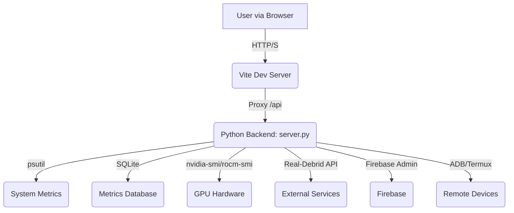

# Chapter 2: System Architecture

## 2.1. High-Level Overview

The Overlord PC Dashboard operates on a hybrid monolithic architecture. A single, powerful Python backend serves as the core for data collection, API provision, and device management, while a vanilla JavaScript single-page application provides a dynamic and responsive user interface.

## 2.2. Backend Architecture

The backend is a monolithic Python application, `server.py`. This design choice prioritizes simplicity of deployment and development speed. The monolith is internally organized into logical modules:

- **HTTP Server**: A custom-built, hardened `http.server.ThreadingHTTPServer`.
- **Stats Collection**: A suite of functions for collecting system metrics using `psutil`.
- **API Endpoints**: A series of handlers for all `/api/*` routes.
- **Database Layer**: A `MetricsDatabase` class for all SQLite interactions.
- **Rate Limiter**: A token-bucket algorithm to prevent API abuse.
- **External Integrations**: Modules for interacting with Firebase, Real-Debrid, ADB, and Termux.

## 2.3. Configuration System

The project utilizes a hierarchical configuration system, ensuring flexibility and security:

1.  **Default Values**: Hardcoded in the `DEFAULTS` dictionary in `server.py`. These are the base settings.
2.  **`config.yaml`**: A user-configurable YAML file that overrides the default values.
3.  **Environment Variables**: Loaded from `.env`, these have the highest priority and override all other settings. This is the required method for storing secrets and API keys.

## 2.4. Database Schema

The SQLite database (`overlord.db`) consists of three primary tables:

- **`metrics`**: Stores time-series data for all system metrics. This is the largest table and is periodically pruned.
- **`alerts`**: A log of any system alerts (e.g., high CPU usage).
- **`rate_limit_blocks`**: A record of any IP addresses that have been blocked by the rate limiter.
