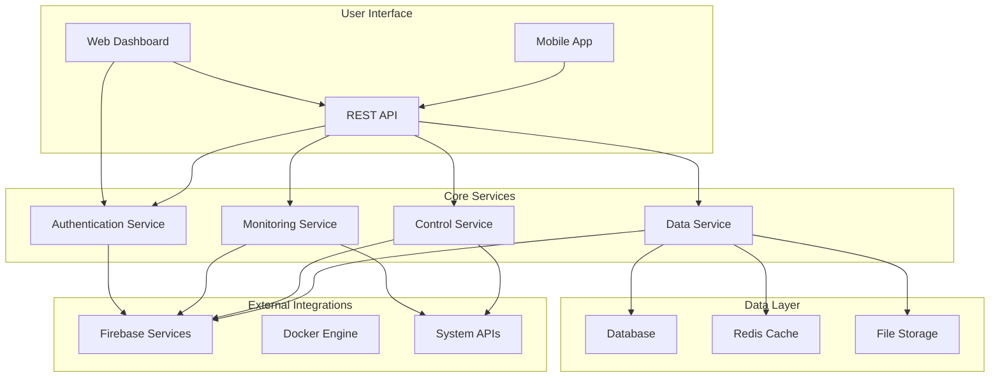
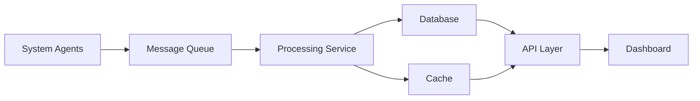
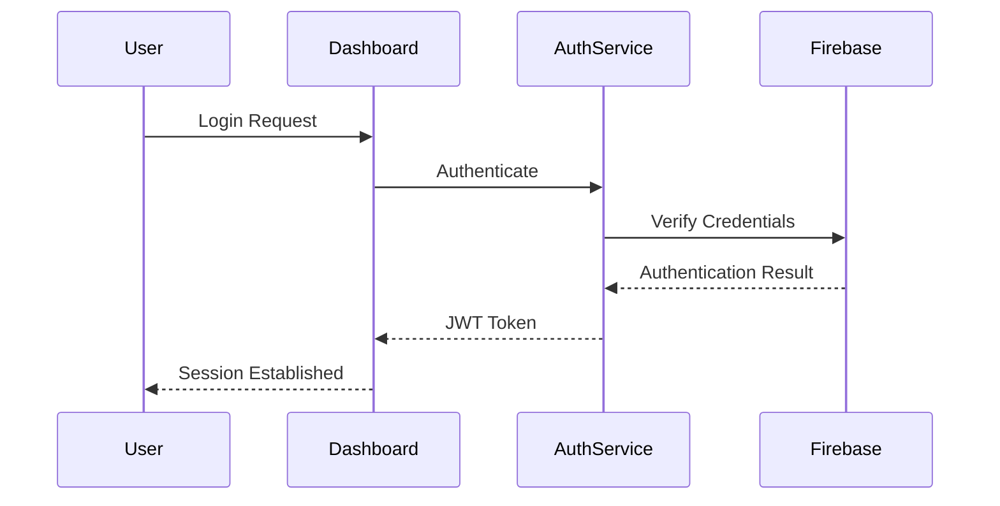
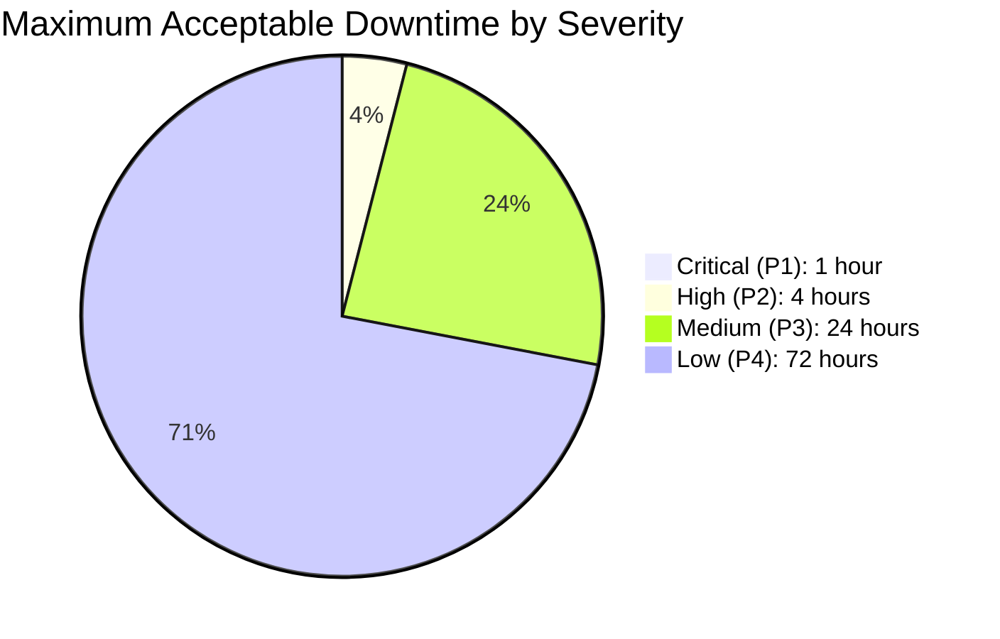
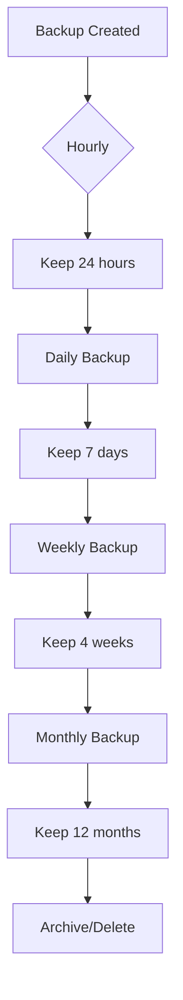
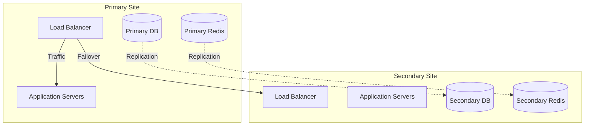
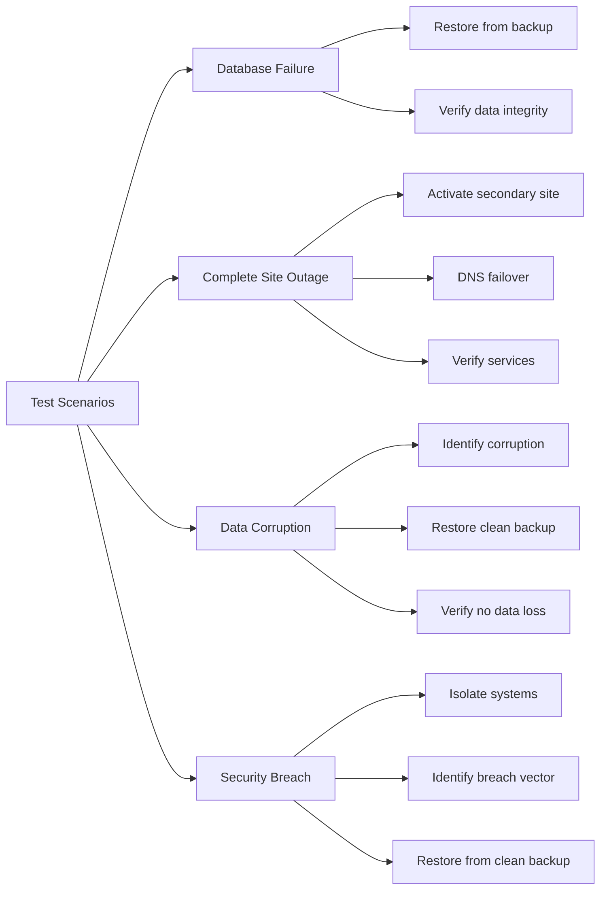

# Overlord PC Dashboard - Architecture Handbook

> **Version:** 1.0.0  
> **Last Updated:** 2026-03-06  

## Table of Contents

1. [System Overview](#system-overview)
2. [High-Level Architecture](#high-level-architecture)
3. [Component Architecture](#component-architecture)
4. [Data Flow & Integration](#data-flow--integration)
5. [Security Architecture](#security-architecture)
6. [Scalability & Performance](#scalability--performance)
7. [Deployment Architecture](#deployment-architecture)
8. [Disaster Recovery Plan](#disaster-recovery-plan)
9. [Future Architecture Considerations](#future-architecture-considerations)
10. [Architecture Decision Records](#architecture-decision-records)

---

## 1. System Overview

### Purpose

The Overlord PC Dashboard is a unified control and monitoring system designed to provide comprehensive management capabilities for PC systems, including:

- **System Monitoring:** Real-time performance metrics and health checks
- **Application Control:** Management of installed applications and services
- **Data Integration:** Centralized data aggregation from multiple sources
- **User Interface:** Responsive web-based dashboard with real-time updates

### Key Features

- **Multi-platform Support:** Windows, Linux, and cross-platform compatibility
- **Real-time Updates:** WebSocket-based live data streaming
- **Modular Architecture:** Extensible plugin system for custom integrations
- **Security-First Design:** Comprehensive authentication and authorization
- **Scalable Infrastructure:** Cloud-native deployment with auto-scaling

---

## 2. High-Level Architecture

### System Architecture Diagram



### Architecture Principles

1. **Microservices:** Loosely coupled services for scalability
2. **Event-Driven:** Asynchronous communication via message queues
3. **API-First:** RESTful APIs with comprehensive documentation
4. **Cloud-Native:** Containerized deployment with orchestration
5. **Security by Design:** Zero-trust architecture with defense in depth

---

## 3. Component Architecture

### 3.1 Frontend Components

#### Dashboard Interface
- **Framework:** React with TypeScript
- **State Management:** Redux with Redux Toolkit
- **Styling:** Tailwind CSS with custom design system
- **Real-time:** Socket.IO for live updates
- **Charts:** Recharts for data visualization

#### Mobile Interface
- **Framework:** React Native
- **Navigation:** React Navigation
- **State:** AsyncStorage + Context API
- **Push Notifications:** Firebase Cloud Messaging

### 3.2 Backend Services

#### Authentication Service
```python
class AuthService:
    def __init__(self):
        self.providers = {
            'local': LocalAuthProvider(),
            'firebase': FirebaseAuthProvider(),
            'oauth': OAuthProvider()
        }
    
    def authenticate(self, provider, credentials):
        return self.providers[provider].authenticate(credentials)
```

#### Monitoring Service
```python
class MonitoringService:
    def __init__(self):
        self.metrics = {
            'cpu': CPUMonitor(),
            'memory': MemoryMonitor(),
            'disk': DiskMonitor(),
            'network': NetworkMonitor()
        }
    
    def collect_metrics(self):
        return {name: monitor.collect() for name, monitor in self.metrics.items()}
```

#### Control Service
```python
class ControlService:
    def __init__(self):
        self.controllers = {
            'process': ProcessController(),
            'service': ServiceController(),
            'system': SystemController()
        }
    
    def execute_action(self, controller, action, params):
        return self.controllers[controller].execute(action, params)
```

### 3.3 Data Services

#### Database Schema
```sql
CREATE TABLE systems (
    id UUID PRIMARY KEY,
    name VARCHAR(255) NOT NULL,
    type VARCHAR(50) NOT NULL,
    status VARCHAR(20) DEFAULT 'offline',
    last_seen TIMESTAMP,
    created_at TIMESTAMP DEFAULT CURRENT_TIMESTAMP
);

CREATE TABLE metrics (
    id UUID PRIMARY KEY,
    system_id UUID REFERENCES systems(id),
    metric_type VARCHAR(50) NOT NULL,
    value JSONB NOT NULL,
    timestamp TIMESTAMP NOT NULL,
    INDEX (system_id, timestamp)
);
```

---

## 4. Data Flow & Integration

### 4.1 Data Collection Pipeline



### 4.2 Integration Patterns

#### Real-time Data Streaming
```javascript
// WebSocket connection for live updates
const socket = io('https://dashboard.overlord.com');

socket.on('system-update', (data) => {
    updateDashboard(data);
});

socket.on('alert', (alert) => {
    showNotification(alert);
});
```

#### REST API Integration
```python
@app.route('/api/v1/systems/<system_id>/metrics', methods=['GET'])
def get_system_metrics(system_id):
    start_time = request.args.get('start', None)
    end_time = request.args.get('end', None)
    
    metrics = MetricService().get_metrics(
        system_id, start_time, end_time
    )
    
    return jsonify(metrics)
```

---

## 5. Security Architecture

### 5.1 Authentication & Authorization

#### Authentication Flow


#### Role-Based Access Control
```yaml
roles:
  admin:
    permissions:
      - system:read
      - system:write
      - user:manage
      - config:edit
  
  operator:
    permissions:
      - system:read
      - system:control
      - alert:view
  
  viewer:
    permissions:
      - system:read
      - dashboard:view
```

### 5.2 Security Controls

#### Network Security
- **TLS 1.3:** All communications encrypted
- **WAF:** Web Application Firewall protection
- **Rate Limiting:** Protection against DDoS attacks
- **IP Whitelisting:** Restricted access to sensitive endpoints

#### Data Security
- **Encryption at Rest:** AES-256 for all stored data
- **Encryption in Transit:** TLS 1.3 for all communications
- **Data Masking:** Sensitive data obfuscated in logs
- **Audit Logging:** Comprehensive access and change tracking

---

## 6. Scalability & Performance

### 6.1 Scalability Architecture

#### Horizontal Scaling
```yaml
# Kubernetes Deployment
apiVersion: apps/v1
kind: Deployment
spec:
  replicas: 3
  selector:
    matchLabels:
      app: overlord-dashboard
  template:
    metadata:
      labels:
        app: overlord-dashboard
    spec:
      containers:
      - name: dashboard
        image: overlord/dashboard:latest
        resources:
          requests:
            memory: "256Mi"
            cpu: "250m"
          limits:
            memory: "512Mi"
            cpu: "500m"
```

#### Auto-scaling Configuration
```yaml
# Horizontal Pod Autoscaler
apiVersion: autoscaling/v2
kind: HorizontalPodAutoscaler
spec:
  scaleTargetRef:
    apiVersion: apps/v1
    kind: Deployment
    name: overlord-dashboard
  minReplicas: 2
  maxReplicas: 10
  metrics:
  - type: Resource
    resource:
      name: cpu
      target:
        type: Utilization
        averageUtilization: 70
```

### 6.2 Performance Optimization

#### Caching Strategy
```python
class CacheService:
    def __init__(self):
        self.cache = RedisCache()
        self.ttl = {
            'system_status': 30,      # 30 seconds
            'metrics_summary': 300,   # 5 minutes
            'dashboard_config': 3600  # 1 hour
        }
    
    def get_cached(self, key, fetch_fn, ttl_key=None):
        cached = self.cache.get(key)
        if cached:
            return cached
        
        data = fetch_fn()
        ttl = self.ttl.get(ttl_key, 300)
        self.cache.set(key, data, ttl)
        return data
```

#### Database Optimization
- **Connection Pooling:** HikariCP for efficient connections
- **Query Optimization:** Indexed queries and query plan analysis
- **Read Replicas:** Separate read and write databases
- **Partitioning:** Time-based partitioning for metrics data

---

## 7. Deployment Architecture

### 7.1 Container Architecture

#### Docker Compose Configuration
```yaml
version: '3.8'

services:
  dashboard:
    build: ./frontend
    ports:
      - "3000:3000"
    environment:
      - NODE_ENV=production
      - API_URL=https://api.overlord.com
    depends_on:
      - api
      - redis

  api:
    build: ./backend
    ports:
      - "8000:8000"
    environment:
      - DATABASE_URL=postgresql://user:pass@db:5432/overlord
      - REDIS_URL=redis://redis:6379
    depends_on:
      - db
      - redis

  db:
    image: postgres:15
    environment:
      - POSTGRES_DB=overlord
      - POSTGRES_USER=overlord
      - POSTGRES_PASSWORD=secret
    volumes:
      - postgres_data:/var/lib/postgresql/data

  redis:
    image: redis:7-alpine
    ports:
      - "6379:6379"

volumes:
  postgres_data:
```

### 7.2 Cloud Deployment

#### Kubernetes Configuration
```yaml
# Namespace
apiVersion: v1
kind: Namespace
metadata:
  name: overlord-dashboard

# Ingress
apiVersion: networking.k8s.io/v1
kind: Ingress
metadata:
  name: overlord-ingress
  annotations:
    kubernetes.io/ingress.class: nginx
    cert-manager.io/cluster-issuer: letsencrypt-prod
spec:
  tls:
  - hosts:
    - dashboard.overlord.com
    secretName: overlord-tls
  rules:
  - host: dashboard.overlord.com
    http:
      paths:
      - path: /
        pathType: Prefix
        backend:
          service:
            name: dashboard-service
            port:
              number: 80
```

---

## 8. Monitoring & Observability

### 8.1 System Monitoring

#### Metrics Collection
```python
class SystemMetrics:
    def __init__(self):
        self.collectors = {
            'prometheus': PrometheusCollector(),
            'custom': CustomMetricCollector()
        }
    
    def collect_all(self):
        metrics = {}
        for name, collector in self.collectors.items():
            metrics[name] = collector.collect()
        return metrics
```

#### Alerting Rules
```yaml
# Prometheus Alerting Rules
groups:
- name: overlord.rules
  rules:
  - alert: HighCPUUsage
    expr: 100 - (avg by (instance) (rate(node_cpu_seconds_total{mode="idle"}[5m])) * 100) > 80
    for: 5m
    labels:
      severity: warning
    annotations:
      summary: "High CPU usage on {{ $labels.instance }}"
      description: "CPU usage is above 80% for more than 5 minutes"

  - alert: DiskSpaceLow
    expr: node_filesystem_avail_bytes{fstype!="tmpfs"} / node_filesystem_size_bytes * 100 < 10
    for: 10m
    labels:
      severity: critical
    annotations:
      summary: "Disk space is low on {{ $labels.instance }}"
      description: "Less than 10% disk space remaining"
```

---

## 8. Disaster Recovery Plan

> **Criticality:** P0 - Mission Critical  
> **Last Updated:** 2026-03-06  
> **Document Owner:** Operations Team

This section outlines the comprehensive disaster recovery procedures for the Overlord PC Dashboard system. All team members must be familiar with these procedures and participate in regular DR testing.

---

### 8.1 Recovery Objectives

#### 8.1.1 Recovery Time Objective (RTO)

| Severity Level | Description | RTO Target | Examples |
|---------------|-------------|------------|----------|
| **Critical (P1)** | Complete system outage affecting all users | 1 hour | Database failure, complete service outage |
| **High (P2)** | Major feature unavailable | 4 hours | Authentication service down, API failures |
| **Medium (P3)** | Minor features affected | 24 hours | Dashboard slow, logging issues |
| **Low (P4)** | Non-critical issues | 72 hours | UI bugs, cosmetic issues |

#### 8.1.2 Recovery Point Objective (RPO)

| Data Type | RPO Target | Backup Frequency |
|-----------|------------|-------------------|
| Database (PostgreSQL) | 15 minutes | Automated every 15 minutes |
| Configuration Files | 1 hour | Hourly snapshots |
| Application State | 5 minutes | Real-time sync |
| User Data | 15 minutes | Automated every 15 minutes |
| Logs and Analytics | 1 hour | Hourly archival |

#### 8.1.3 Downtime Tolerance by Severity



---

### 8.2 Backup Strategy

#### 8.2.1 Database Backup (PostgreSQL)

```yaml
# Database Backup Configuration
backup:
  schedule: "*/15 * * * *"  # Every 15 minutes
  retention:
    hourly: 24      # Keep last 24 hourly backups
    daily: 7         # Keep last 7 daily backups
    weekly: 4        # Keep last 4 weekly backups
    monthly: 12     # Keep last 12 monthly backups
  
  storage:
    type: "offsite"
    destination: "s3://overlord-backups/database"
    encryption: "AES-256"
    
  verification:
    test_restore: true
    test_frequency: "weekly"
```

**Backup Script Location:** `./scripts/backup-database.sh`

```bash
#!/bin/bash
# PostgreSQL Backup Script
# Usage: ./backup-database.sh

set -e

# Configuration
DB_NAME="overlord"
DB_USER="overlord"
BACKUP_DIR="/var/backups/postgresql"
S3_BUCKET="s3://overlord-backups/database"
DATE=$(date +%Y%m%d_%H%M%S)

# Create backup
pg_dump -U $DB_USER -Fc $DB_NAME > "$BACKUP_DIR/${DB_NAME}_${DATE}.dump"

# Compress and encrypt
tar -czf "$BACKUP_DIR/${DB_NAME}_${DATE}.tar.gz" -C $BACKUP_DIR "${DB_NAME}_${DATE}.dump"

# Upload to S3
aws s3 cp "$BACKUP_DIR/${DB_NAME}_${DATE}.tar.gz" "$S3_BUCKET/${DB_NAME}_${DATE}.tar.gz"

# Cleanup old local backups (keep last 7 days)
find $BACKUP_DIR -name "*.dump" -mtime +7 -delete
find $BACKUP_DIR -name "*.tar.gz" -mtime +7 -delete

echo "Backup completed: ${DB_NAME}_${DATE}"
```

#### 8.2.2 Configuration Backup

| Configuration Type | Backup Method | Frequency | Retention |
|-------------------|---------------|-----------|----------|
| Environment Variables | Git repository | On change | 90 days |
| Docker Compose | Git repository | On change | 90 days |
| Kubernetes manifests | Git repository | On change | 90 days |
| SSL Certificates | Encrypted storage | Weekly + on renewal | 1 year |
| API Keys/Secrets | HashiCorp Vault | On change | Indefinite |

```yaml
# Configuration Backup Script
config_backup:
  source_paths:
    - ".env"
    - ".env.example"
    - "config.yaml"
    - "docker-compose.yml"
    - "docker-compose.override.yml"
    - "apphosting.yaml"
  
  exclude_patterns:
    - "*.log"
    - ".git/*"
    - "node_modules/*"
    - "__pycache__/*"
  
  destination: "s3://overlord-backups/config"
  encryption: "AES-256"
```

#### 8.2.3 Application State Backup

| Component | State Data | Backup Method | Frequency |
|-----------|------------|---------------|----------|
| Redis Cache | Session data, real-time metrics | RDB + AOF | Every 5 minutes |
| File Storage | User uploads, logs | Rsync to offsite | Hourly |
| Docker Volumes | Persistent application data | snapshots | Daily |

#### 8.2.4 Backup Retention Policy



---

### 8.3 Recovery Procedures

#### 8.3.1 Database Restoration Procedure

**Prerequisites:**
- PostgreSQL instance running
- Valid backup file available in S3 or local storage
- Sufficient disk space (2x backup size)

**Step-by-Step Instructions:**

```bash
#!/bin/bash
# Database Restoration Script
# Usage: ./restore-database.sh <backup_timestamp>

set -e

BACKUP_TIMESTAMP=$1
DB_NAME="overlord"
DB_USER="overlord"
S3_BUCKET="s3://overlord-backups/database"
TEMP_DIR="/tmp/restore"

# 1. Stop all services
echo "Step 1: Stopping services..."
sudo docker-compose down

# 2. Create temp directory
echo "Step 2: Creating temp directory..."
mkdir -p $TEMP_DIR

# 3. Download backup from S3
echo "Step 3: Downloading backup from S3..."
aws s3 cp "$S3_BUCKET/${DB_NAME}_${BACKUP_TIMESTAMP}.tar.gz" "$TEMP_DIR/"

# 4. Extract backup
echo "Step 4: Extracting backup..."
tar -xzf "$TEMP_DIR/${DB_NAME}_${BACKUP_TIMESTAMP}.tar.gz" -C $TEMP_DIR/

# 5. Drop existing database (if exists)
echo "Step 5: Dropping existing database..."
dropdb -U $DB_USER $DB_NAME || true

# 6. Create fresh database
echo "Step 6: Creating fresh database..."
createdb -U $DB_USER $DB_NAME

# 7. Restore database
echo "Step 7: Restoring database..."
pg_restore -U $DB_USER -d $DB_NAME -Fc "$TEMP_DIR/${DB_NAME}_${BACKUP_TIMESTAMP}.dump"

# 8. Verify restoration
echo "Step 8: Verifying restoration..."
psql -U $DB_USER -d $DB_NAME -c "SELECT COUNT(*) FROM systems;"

# 9. Start services
echo "Step 9: Starting services..."
sudo docker-compose up -d

# 10. Cleanup
echo "Step 10: Cleaning up..."
rm -rf $TEMP_DIR

echo "Database restoration completed successfully!"
```

#### 8.3.2 Service Restoration Checklist

```markdown
## Service Restoration Checklist

### Pre-Restoration
- [ ] Assess the nature and scope of the incident
- [ ] Notify all stakeholders (see Communication section)
- [ ] Document the incident in the incident tracker
- [ ] Ensure backup integrity before proceeding

### Database Restoration
- [ ] Execute database restoration procedure
- [ ] Verify database connectivity
- [ ] Check database integrity (table counts, indexes)
- [ ] Validate foreign key relationships

### Application Services
- [ ] Start Docker containers in correct order
- [ ] Verify all services are healthy (health checks)
- [ ] Check service logs for errors
- [ ] Validate API endpoints responding

### Frontend
- [ ] Verify dashboard loads correctly
- [ ] Test real-time updates (WebSocket)
- [ ] Check all static assets loading
- [ ] Validate authentication flow

### Post-Restoration
- [ ] Run data verification queries
- [ ] Confirm user sessions working
- [ ] Test critical user workflows
- [ ] Update stakeholders with restoration status
- [ ] Schedule post-incident review
```

#### 8.3.3 Data Verification Steps

```sql
-- Data Verification Queries

-- 1. Check table row counts
SELECT 
    schemaname,
    relname,
    n_live_tup 
FROM pg_stat_user_tables 
ORDER BY n_live_tup DESC;

-- 2. Verify recent data exists
SELECT MAX(created_at) FROM systems;
SELECT MAX(timestamp) FROM metrics;

-- 3. Check for data corruption
SELECT * FROM systems WHERE id IS NULL;
SELECT * FROM metrics WHERE value IS NULL;

-- 4. Verify foreign key integrity
SELECT COUNT(*) FROM metrics m 
LEFT JOIN systems s ON m.system_id = s.id 
WHERE s.id IS NULL;
```

---

### 8.4 Failover Strategy

#### 8.4.1 Architecture Overview



#### 8.4.2 Manual vs Automatic Failover

| Scenario | Failover Type | Trigger | Action |
|----------|--------------|---------|--------|
| Database primary failure | Automatic | Replication lag > 5 min | Promote replica |
| Application server failure | Automatic | Health check failure | Restart/replace container |
| Complete site failure | Manual | All services down | DNS failover to secondary |
| Data corruption | Manual | Detection | Restore from backup |
| Security breach | Manual | Threat detected | Isolate affected systems |

#### 8.4.3 Failback Procedures

```bash
#!/bin/bash
# Failback Procedure
# Usage: ./failback.sh

set -e

echo "Starting failback procedure..."

# 1. Ensure primary site is healthy
echo "Step 1: Verifying primary site health..."
# Add health check commands here

# 2. Stop accepting traffic on secondary
echo "Step 2: Stopping traffic on secondary..."
# Update DNS to point to primary

# 3. Sync any remaining data
echo "Step 3: Syncing remaining data..."
# Run final replication sync

# 4. Restore primary database
echo "Step 4: Restoring primary database..."
# Restore latest backup to primary

# 5. Restart services on primary
echo "Step 5: Restarting services on primary..."
sudo docker-compose up -d

# 6. Verify primary site
echo "Step 6: Verifying primary site..."
# Run verification checks

# 7. Update DNS to primary
echo "Step 7: Updating DNS to primary..."
# Point DNS back to primary

echo "Failback completed successfully!"
```

---

### 8.5 Contact & Communication

#### 8.5.1 Incident Response Contacts

| Role | Name | Phone | Email | Response Time |
|------|------|-------|-------|---------------|
| Primary On-Call | [TBD] | [Phone] | oncall@overlord.com | 15 minutes |
| Secondary On-Call | [TBD] | [Phone] | oncall-secondary@overlord.com | 30 minutes |
| Engineering Lead | [TBD] | [Phone] | eng-lead@overlord.com | 1 hour |
| Infrastructure | [TBD] | [Phone] | infra@overlord.com | 1 hour |
| Management | [TBD] | [Phone] | management@overlord.com | 2 hours |

#### 8.5.2 Communication Templates

**Initial Incident Notification:**

```markdown
## Incident Report - [SEVERITY]

**Incident ID:** INC-[NUMBER]
**Title:** [Brief description]
**Severity:** [P1/P2/P3/P4]
**Status:** [Investigating/Identified/Monitoring/Resolved]

**Affected Services:**
- [Service 1]
- [Service 2]

**Impact:**
- [Number] users affected
- [Percentage] of system functionality impacted

**Current Actions:**
- [Action 1]
- [Action 2]

**Next Steps:**
- [Next action]

**ETA for Update:** [Time]
```

**Stakeholder Notification (P1/P2):**

```markdown
## Urgent: System Incident Notification

Dear [Stakeholders],

We are currently experiencing a [brief description of incident] affecting [affected services].

**Current Status:** [Investigating/Identified/Monitoring/Resolved]
**Impact:** [Description of user impact]
**Estimated Resolution:** [Time/Unknown]

Our team is actively working to restore service. We will provide updates every [30 minutes/1 hour].

For real-time updates, visit: [Status Page URL]

Apologies for the inconvenience.
[Your Name]
On-Call Team
```

#### 8.5.3 Communication Channels

| Channel | Purpose | When to Use |
|---------|---------|------------|
| Status Page | Public updates | All P1/P2 incidents |
| Slack #incidents | Internal coordination | All incidents |
| Email | Stakeholder notification | P1/P2 only |
| PagerDuty | On-call alerts | P1/P2 critical |
| Phone | Critical escalation | P1 critical only |

---

### 8.6 Testing

#### 8.6.1 Disaster Recovery Testing Schedule

| Test Type | Frequency | Participants | Duration |
|-----------|-----------|--------------|----------|
| Backup Verification | Weekly | DevOps | 1 hour |
| tabletop Exercise | Monthly | All stakeholders | 2 hours |
| Partial Failover | Quarterly | Engineering | 4 hours |
| Full DR Test | Annually | All teams | 8 hours |

#### 8.6.2 Test Scenarios



**Tabletop Exercise Checklist:**

- [ ] Review incident scenarios
- [ ] Walk through response procedures
- [ ] Identify gaps in documentation
- [ ] Update contact information
- [ ] Test communication channels
- [ ] Document lessons learned

#### 8.6.3 Post-Incident Review Process

```markdown
## Post-Incident Review Template

### Incident Summary
- **Incident ID:**
- **Date/Time:**
- **Duration:**
- **Severity:**
- **Root Cause:**

### Timeline
| Time | Event |
|------|-------|
| HH:MM | Incident detected |
| HH:MM | Response initiated |
| HH:MM | Root cause identified |
| HH:MM | Service restored |

### What Went Well
- [Item 1]
- [Item 2]

### What Could Be Improved
- [Item 1]
- [Item 2]

### Action Items
| Item | Owner | Due Date |
|------|-------|----------|
| [Action] | [Owner] | [Date] |

### Lessons Learned
- [Lesson 1]
- [Lesson 2]
```

---

## 9. Future Architecture Considerations

### 9.1 Planned Enhancements

#### AI/ML Integration
- **Predictive Analytics:** Machine learning for anomaly detection
- **Automated Remediation:** AI-powered incident response
- **Natural Language Interface:** Chat-based system control

#### Edge Computing
- **Edge Agents:** Local processing for reduced latency
- **Offline Mode:** Full functionality without internet connectivity
- **Federated Learning:** Distributed model training

#### Advanced Security
- **Zero Trust Architecture:** Continuous verification
- **Quantum-Resistant Encryption:** Future-proof security
- **Behavioral Analytics:** User and system behavior monitoring

---

## 10. Architecture Decision Records

### 10.1 Key Decisions

#### Microservices vs Monolith
**Decision:** Microservices architecture
**Rationale:** Scalability, independent deployment, technology diversity
**Trade-offs:** Increased complexity, network latency, distributed transactions

#### Database Selection
**Decision:** PostgreSQL with Redis caching
**Rationale:** ACID compliance, JSON support, mature ecosystem
**Trade-offs:** Operational complexity, memory usage

#### Container Orchestration
**Decision:** Kubernetes
**Rationale:** Industry standard, rich ecosystem, auto-scaling
**Trade-offs:** Learning curve, resource overhead

---

## 8. Disaster Recovery Plan

> **Criticality:** P0 - Mission Critical  
> **Last Updated:** 2026-03-06  
> **Document Owner:** Operations Team

This section outlines the comprehensive disaster recovery procedures for the Overlord PC Dashboard system. All team members must be familiar with these procedures and participate in regular DR testing.

---

### 8.1 Recovery Objectives

#### 8.1.1 Recovery Time Objective (RTO)

| Severity Level | Description | RTO Target | Examples |
|---------------|-------------|------------|----------|
| **Critical (P1)** | Complete system outage affecting all users | 1 hour | Database failure, complete service outage |
| **High (P2)** | Major feature unavailable | 4 hours | Authentication service down, API failures |
| **Medium (P3)** | Minor features affected | 24 hours | Dashboard slow, logging issues |
| **Low (P4)** | Non-critical issues | 72 hours | UI bugs, cosmetic issues |

#### 8.1.2 Recovery Point Objective (RPO)

| Data Type | RPO Target | Backup Frequency |
|-----------|------------|-------------------|
| Database (PostgreSQL) | 15 minutes | Automated every 15 minutes |
| Configuration Files | 1 hour | Hourly snapshots |
| Application State | 5 minutes | Real-time sync |
| User Data | 15 minutes | Automated every 15 minutes |
| Logs and Analytics | 1 hour | Hourly archival |

#### 8.1.3 Downtime Tolerance by Severity


---

### 8.2 Backup Strategy

#### 8.2.1 Database Backup (PostgreSQL)

```yaml
# Database Backup Configuration
backup:
  schedule: "*/15 * * * *"  # Every 15 minutes
  retention:
    hourly: 24      # Keep last 24 hourly backups
    daily: 7         # Keep last 7 daily backups
    weekly: 4        # Keep last 4 weekly backups
    monthly: 12     # Keep last 12 monthly backups
  
  storage:
    type: "offsite"
    destination: "s3://overlord-backups/database"
    encryption: "AES-256"
    
  verification:
    test_restore: true
    test_frequency: "weekly"
```

**Backup Script Location:** `./scripts/backup-database.sh`

```bash
#!/bin/bash
# PostgreSQL Backup Script
# Usage: ./backup-database.sh

set -e

# Configuration
DB_NAME="overlord"
DB_USER="overlord"
BACKUP_DIR="/var/backups/postgresql"
S3_BUCKET="s3://overlord-backups/database"
DATE=$(date +%Y%m%d_%H%M%S)

# Create backup
pg_dump -U $DB_USER -Fc $DB_NAME > "$BACKUP_DIR/${DB_NAME}_${DATE}.dump"

# Compress and encrypt
tar -czf "$BACKUP_DIR/${DB_NAME}_${DATE}.tar.gz" -C $BACKUP_DIR "${DB_NAME}_${DATE}.dump"

# Upload to S3
aws s3 cp "$BACKUP_DIR/${DB_NAME}_${DATE}.tar.gz" "$S3_BUCKET/${DB_NAME}_${DATE}.tar.gz"

# Cleanup old local backups (keep last 7 days)
find $BACKUP_DIR -name "*.dump" -mtime +7 -delete
find $BACKUP_DIR -name "*.tar.gz" -mtime +7 -delete

echo "Backup completed: ${DB_NAME}_${DATE}"
```

#### 8.2.2 Configuration Backup

| Configuration Type | Backup Method | Frequency | Retention |
|-------------------|---------------|-----------|----------|
| Environment Variables | Git repository | On change | 90 days |
| Docker Compose | Git repository | On change | 90 days |
| Kubernetes manifests | Git repository | On change | 90 days |
| SSL Certificates | Encrypted storage | Weekly + on renewal | 1 year |
| API Keys/Secrets | HashiCorp Vault | On change | Indefinite |

```yaml
# Configuration Backup Script
config_backup:
  source_paths:
    - ".env"
    - ".env.example"
    - "config.yaml"
    - "docker-compose.yml"
    - "docker-compose.override.yml"
    - "apphosting.yaml"
  
  exclude_patterns:
    - "*.log"
    - ".git/*"
    - "node_modules/*"
    - "__pycache__/*"
  
  destination: "s3://overlord-backups/config"
  encryption: "AES-256"
```

#### 8.2.3 Application State Backup

| Component | State Data | Backup Method | Frequency |
|-----------|------------|---------------|----------|
| Redis Cache | Session data, real-time metrics | RDB + AOF | Every 5 minutes |
| File Storage | User uploads, logs | Rsync to offsite | Hourly |
| Docker Volumes | Persistent application data | snapshots | Daily |

#### 8.2.4 Backup Retention Policy


---

### 8.3 Recovery Procedures

#### 8.3.1 Database Restoration Procedure

**Prerequisites:**
- PostgreSQL instance running
- Valid backup file available in S3 or local storage
- Sufficient disk space (2x backup size)

**Step-by-Step Instructions:**

```bash
#!/bin/bash
# Database Restoration Script
# Usage: ./restore-database.sh <backup_timestamp>

set -e

BACKUP_TIMESTAMP=$1
DB_NAME="overlord"
DB_USER="overlord"
S3_BUCKET="s3://overlord-backups/database"
TEMP_DIR="/tmp/restore"

# 1. Stop all services
echo "Step 1: Stopping services..."
sudo docker-compose down

# 2. Create temp directory
echo "Step 2: Creating temp directory..."
mkdir -p $TEMP_DIR

# 3. Download backup from S3
echo "Step 3: Downloading backup from S3..."
aws s3 cp "$S3_BUCKET/${DB_NAME}_${BACKUP_TIMESTAMP}.tar.gz" "$TEMP_DIR/"

# 4. Extract backup
echo "Step 4: Extracting backup..."
tar -xzf "$TEMP_DIR/${DB_NAME}_${BACKUP_TIMESTAMP}.tar.gz" -C $TEMP_DIR/

# 5. Drop existing database (if exists)
echo "Step 5: Dropping existing database..."
dropdb -U $DB_USER $DB_NAME || true

# 6. Create fresh database
echo "Step 6: Creating fresh database..."
createdb -U $DB_USER $DB_NAME

# 7. Restore database
echo "Step 7: Restoring database..."
pg_restore -U $DB_USER -d $DB_NAME -Fc "$TEMP_DIR/${DB_NAME}_${BACKUP_TIMESTAMP}.dump"

# 8. Verify restoration
echo "Step 8: Verifying restoration..."
psql -U $DB_USER -d $DB_NAME -c "SELECT COUNT(*) FROM systems;"

# 9. Start services
echo "Step 9: Starting services..."
sudo docker-compose up -d

# 10. Cleanup
echo "Step 10: Cleaning up..."
rm -rf $TEMP_DIR

echo "Database restoration completed successfully!"
```

#### 8.3.2 Service Restoration Checklist

```markdown
## Service Restoration Checklist

### Pre-Restoration
- [ ] Assess the nature and scope of the incident
- [ ] Notify all stakeholders (see Communication section)
- [ ] Document the incident in the incident tracker
- [ ] Ensure backup integrity before proceeding

### Database Restoration
- [ ] Execute database restoration procedure
- [ ] Verify database connectivity
- [ ] Check database integrity (table counts, indexes)
- [ ] Validate foreign key relationships

### Application Services
- [ ] Start Docker containers in correct order
- [ ] Verify all services are healthy (health checks)
- [ ] Check service logs for errors
- [ ] Validate API endpoints responding

### Frontend
- [ ] Verify dashboard loads correctly
- [ ] Test real-time updates (WebSocket)
- [ ] Check all static assets loading
- [ ] Validate authentication flow

### Post-Restoration
- [ ] Run data verification queries
- [ ] Confirm user sessions working
- [ ] Test critical user workflows
- [ ] Update stakeholders with restoration status
- [ ] Schedule post-incident review
```

#### 8.3.3 Data Verification Steps

```sql
-- Data Verification Queries

-- 1. Check table row counts
SELECT 
    schemaname,
    relname,
    n_live_tup 
FROM pg_stat_user_tables 
ORDER BY n_live_tup DESC;

-- 2. Verify recent data exists
SELECT MAX(created_at) FROM systems;
SELECT MAX(timestamp) FROM metrics;

-- 3. Check for data corruption
SELECT * FROM systems WHERE id IS NULL;
SELECT * FROM metrics WHERE value IS NULL;

-- 4. Verify foreign key integrity
SELECT COUNT(*) FROM metrics m 
LEFT JOIN systems s ON m.system_id = s.id 
WHERE s.id IS NULL;
```

---

### 8.4 Failover Strategy

#### 8.4.1 Architecture Overview


#### 8.4.2 Manual vs Automatic Failover

| Scenario | Failover Type | Trigger | Action |
|----------|--------------|---------|--------|
| Database primary failure | Automatic | Replication lag > 5 min | Promote replica |
| Application server failure | Automatic | Health check failure | Restart/replace container |
| Complete site failure | Manual | All services down | DNS failover to secondary |
| Data corruption | Manual | Detection | Restore from backup |
| Security breach | Manual | Threat detected | Isolate affected systems |

#### 8.4.3 Failback Procedures

```bash
#!/bin/bash
# Failback Procedure
# Usage: ./failback.sh

set -e

echo "Starting failback procedure..."

# 1. Ensure primary site is healthy
echo "Step 1: Verifying primary site health..."
# Add health check commands here

# 2. Stop accepting traffic on secondary
echo "Step 2: Stopping traffic on secondary..."
# Update DNS to point to primary

# 3. Sync any remaining data
echo "Step 3: Syncing remaining data..."
# Run final replication sync

# 4. Restore primary database
echo "Step 4: Restoring primary database..."
# Restore latest backup to primary

# 5. Restart services on primary
echo "Step 5: Restarting services on primary..."
sudo docker-compose up -d

# 6. Verify primary site
echo "Step 6: Verifying primary site..."
# Run verification checks

# 7. Update DNS to primary
echo "Step 7: Updating DNS to primary..."
# Point DNS back to primary

echo "Failback completed successfully!"
```

---

### 8.5 Contact & Communication

#### 8.5.1 Incident Response Contacts

| Role | Name | Phone | Email | Response Time |
|------|------|-------|-------|---------------|
| Primary On-Call | [TBD] | [Phone] | oncall@overlord.com | 15 minutes |
| Secondary On-Call | [TBD] | [Phone] | oncall-secondary@overlord.com | 30 minutes |
| Engineering Lead | [TBD] | [Phone] | eng-lead@overlord.com | 1 hour |
| Infrastructure | [TBD] | [Phone] | infra@overlord.com | 1 hour |
| Management | [TBD] | [Phone] | management@overlord.com | 2 hours |

#### 8.5.2 Communication Templates

**Initial Incident Notification:**

```markdown
## Incident Report - [SEVERITY]

**Incident ID:** INC-[NUMBER]
**Title:** [Brief description]
**Severity:** [P1/P2/P3/P4]
**Status:** [Investigating/Identified/Monitoring/Resolved]

**Affected Services:**
- [Service 1]
- [Service 2]

**Impact:**
- [Number] users affected
- [Percentage] of system functionality impacted

**Current Actions:**
- [Action 1]
- [Action 2]

**Next Steps:**
- [Next action]

**ETA for Update:** [Time]
```

**Stakeholder Notification (P1/P2):**

```markdown
## Urgent: System Incident Notification

Dear [Stakeholders],

We are currently experiencing a [brief description of incident] affecting [affected services].

**Current Status:** [Investigating/Identified/Monitoring/Resolved]
**Impact:** [Description of user impact]
**Estimated Resolution:** [Time/Unknown]

Our team is actively working to restore service. We will provide updates every [30 minutes/1 hour].

For real-time updates, visit: [Status Page URL]

Apologies for the inconvenience.
[Your Name]
On-Call Team
```

#### 8.5.3 Communication Channels

| Channel | Purpose | When to Use |
|---------|---------|------------|
| Status Page | Public updates | All P1/P2 incidents |
| Slack #incidents | Internal coordination | All incidents |
| Email | Stakeholder notification | P1/P2 only |
| PagerDuty | On-call alerts | P1/P2 critical |
| Phone | Critical escalation | P1 critical only |

---

### 8.6 Testing

#### 8.6.1 Disaster Recovery Testing Schedule

| Test Type | Frequency | Participants | Duration |
|-----------|-----------|--------------|----------|
| Backup Verification | Weekly | DevOps | 1 hour |
| tabletop Exercise | Monthly | All stakeholders | 2 hours |
| Partial Failover | Quarterly | Engineering | 4 hours |
| Full DR Test | Annually | All teams | 8 hours |

#### 8.6.2 Test Scenarios


**Tabletop Exercise Checklist:**

- [ ] Review incident scenarios
- [ ] Walk through response procedures
- [ ] Identify gaps in documentation
- [ ] Update contact information
- [ ] Test communication channels
- [ ] Document lessons learned

#### 8.6.3 Post-Incident Review Process

```markdown
## Post-Incident Review Template

### Incident Summary
- **Incident ID:**
- **Date/Time:**
- **Duration:**
- **Severity:**
- **Root Cause:**

### Timeline
| Time | Event |
|------|-------|
| HH:MM | Incident detected |
| HH:MM | Response initiated |
| HH:MM | Root cause identified |
| HH:MM | Service restored |

### What Went Well
- [Item 1]
- [Item 2]

### What Could Be Improved
- [Item 1]
- [Item 2]

### Action Items
| Item | Owner | Due Date |
|------|-------|----------|
| [Action] | [Owner] | [Date] |

### Lessons Learned
- [Lesson 1]
- [Lesson 2]
```

---

## Conclusion

This architecture provides a robust, scalable, and secure foundation for the Overlord PC Dashboard. The modular design allows for future enhancements while maintaining system stability and performance.

**Next Steps:**
1. Review and validate architecture decisions
2. Implement monitoring and observability
3. Plan for scalability testing
4. Develop disaster recovery procedures

---

*Architecture version: 1.0.0 | Last updated: 2026-03-06*