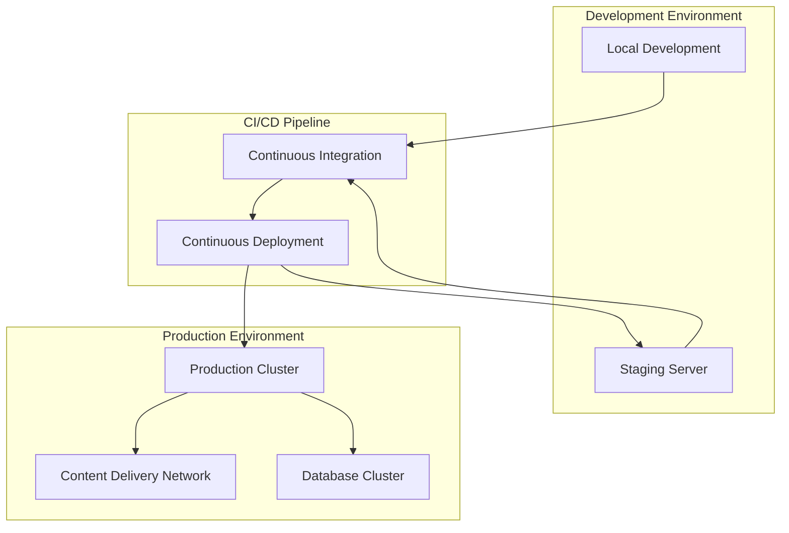

# Overlord PC Dashboard - Deployment & Operations Handbook

> **Version:** 1.0.0  
> **Last Updated:** 2026-03-06  

## Table of Contents

1. [Deployment Overview](#deployment-overview)
2. [Environment Setup](#environment-setup)
3. [Deployment Strategies](#deployment-strategies)
4. [Production Deployment](#production-deployment)
5. [Monitoring & Observability](#monitoring--observability)
6. [Backup & Recovery](#backup--recovery)
7. [Scaling & Performance](#scaling--performance)
8. [Security Operations](#security-operations)
9. [Incident Response](#incident-response)
10. [Maintenance Procedures](#maintenance-procedures)

---

## 1. Deployment Overview

### 1.1 Deployment Architecture

#### Multi-Environment Strategy


#### Deployment Targets
- **Local Development:** Docker Compose, local database
- **Staging:** Kubernetes cluster, replica database
- **Production:** Multi-zone Kubernetes, managed database
- **Edge Locations:** CDN for static assets, regional API endpoints

---

## 2. Environment Setup

### 2.1 Development Environment

#### Prerequisites
```bash
# Install required tools
curl -fsSL https://get.docker.com -o get-docker.sh
sudo sh get-docker.sh
sudo usermod -aG docker $USER

# Install Docker Compose
sudo curl -L "https://github.com/docker/compose/releases/latest/download/docker-compose-$(uname -s)-$(uname -m)" -o /usr/local/bin/docker-compose
sudo chmod +x /usr/local/bin/docker-compose

# Install kubectl
curl -LO "https://dl.k8s.io/release/$(curl -L -s https://dl.k8s.io/release/stable.txt)/bin/linux/amd64/kubectl"
sudo install -o root -g root -m 0755 kubectl /usr/local/bin/kubectl

# Install Node.js (LTS)
curl -fsSL https://deb.nodesource.com/setup_lts.x | sudo -E bash -
sudo apt-get install -y nodejs

# Install Python
sudo apt-get install python3.9 python3.9-venv
```

#### Environment Configuration
```bash
# Clone the repository
git clone https://github.com/your-org/overlord-pc-dashboard.git
cd overlord-pc-dashboard

# Create environment files
cp .env.example .env
cp config.yaml.example config.yaml

# Edit configuration
nano .env
nano config.yaml

# Set up Python virtual environment
python3.9 -m venv venv
source venv/bin/activate  # Linux/Mac
# or
venv\Scripts\activate     # Windows

# Install Python dependencies
pip install -e .

# Install Node.js dependencies
cd frontend
npm ci
cd ..
```

### 2.2 Staging Environment

#### Kubernetes Setup
```bash
# Install Minikube for local Kubernetes
curl -LO https://storage.googleapis.com/minikube/releases/latest/minikube-linux-amd64
sudo install minikube-linux-amd64 /usr/local/bin/minikube

# Start Minikube cluster
minikube start --cpus=4 --memory=8192 --disk-size=40g

# Enable addons
minikube addons enable ingress
minikube addons enable metrics-server

# Configure kubectl
kubectl config use-context minikube
```

#### Staging Configuration
```yaml
# config/staging.yaml
environment: staging
api:
  url: https://api.staging.overlord.com
  timeout: 30s
database:
  host: staging-db.overlord.com
  port: 5432
  name: overlord_staging
  ssl: true
redis:
  host: staging-redis.overlord.com
  port: 6379
  password: ${REDIS_PASSWORD}
monitoring:
  enabled: true
  endpoint: https://monitoring.staging.overlord.com
```

---

## 3. Deployment Strategies

### 3.1 Deployment Methods

#### Blue-Green Deployment
```yaml
# Kubernetes deployment for blue-green
apiVersion: apps/v1
kind: Deployment
metadata:
  name: overlord-blue
  labels:
    app: overlord
    version: blue
spec:
  replicas: 3
  selector:
    matchLabels:
      app: overlord
      version: blue
  template:
    metadata:
      labels:
        app: overlord
        version: blue
    spec:
      containers:
      - name: overlord
        image: overlord/dashboard:blue
        ports:
        - containerPort: 80
---
apiVersion: apps/v1
kind: Deployment
metadata:
  name: overlord-green
  labels:
    app: overlord
    version: green
spec:
  replicas: 0
  selector:
    matchLabels:
      app: overlord
      version: green
  template:
    metadata:
      labels:
        app: overlord
        version: green
    spec:
      containers:
      - name: overlord
        image: overlord/dashboard:green
        ports:
        - containerPort: 80
```

#### Canary Deployment
```yaml
# Kubernetes canary deployment
apiVersion: argoproj.io/v1alpha1
kind: Rollout
metadata:
  name: overlord-canary
spec:
  replicas: 10
  strategy:
    canary:
      steps:
      - setWeight: 20
      - pause: {duration: 10m}
      - setWeight: 50
      - pause: {duration: 10m}
      - setWeight: 100
  selector:
    matchLabels:
      app: overlord
  template:
    metadata:
      labels:
        app: overlord
    spec:
      containers:
      - name: overlord
        image: overlord/dashboard:canary
        ports:
        - containerPort: 80
```

### 3.2 Deployment Automation

#### CI/CD Pipeline Configuration
```yaml
# .github/workflows/deploy.yml
name: Deploy Overlord Dashboard

on:
  push:
    branches: [main, develop]
  pull_request:
    branches: [main]

jobs:
  test:
    runs-on: ubuntu-latest
    steps:
    - uses: actions/checkout@v3
    - name: Set up Python
      uses: actions/setup-python@v4
      with:
        python-version: '3.9'
    - name: Install dependencies
      run: |
        python -m pip install --upgrade pip
        pip install -e ".[test]"
    - name: Run tests
      run: pytest
    
  deploy-staging:
    needs: test
    if: github.ref == 'refs/heads/develop'
    runs-on: ubuntu-latest
    steps:
    - uses: actions/checkout@v3
    - name: Deploy to staging
      run: |
        kubectl config use-context staging
        kubectl apply -f k8s/
        kubectl rollout status deployment/overlord-dashboard
    
  deploy-production:
    needs: test
    if: github.ref == 'refs/heads/main'
    runs-on: ubuntu-latest
    steps:
    - uses: actions/checkout@v3
    - name: Deploy to production
      run: |
        kubectl config use-context production
        kubectl apply -f k8s/
        kubectl rollout status deployment/overlord-dashboard
```

---

## 4. Production Deployment

### 4.1 Pre-Deployment Checklist

#### Infrastructure Verification
```bash
# Check cluster health
kubectl get nodes
kubectl get pods --all-namespaces
kubectl top nodes
kubectl top pods

# Verify storage
kubectl get pv
kubectl get pvc

# Check network policies
kubectl get networkpolicies
```

#### Application Verification
```bash
# Check configuration
kubectl exec -it overlord-dashboard-xxx -- cat /app/config.yaml

# Verify database connectivity
kubectl exec -it overlord-dashboard-xxx -- python -c "
import psycopg2
import os

conn = psycopg2.connect(
    host=os.getenv('DATABASE_HOST'),
    port=os.getenv('DATABASE_PORT'),
    dbname=os.getenv('DATABASE_NAME'),
    user=os.getenv('DATABASE_USER'),
    password=os.getenv('DATABASE_PASSWORD')
)
print('Database connection successful')
conn.close()
"

# Test API endpoints
curl -f https://api.overlord.com/health || echo "Health check failed"
```

### 4.2 Deployment Process

#### Step-by-Step Deployment
```bash
# 1. Prepare deployment
git pull origin main
npm run build
python setup.py sdist bdist_wheel

# 2. Tag release
git tag -a v1.0.0 -m "Release version 1.0.0"
git push origin v1.0.0

# 3. Update Kubernetes manifests
kubectl set image deployment/overlord-dashboard overlord-dashboard=overlord/dashboard:v1.0.0

# 4. Verify deployment
kubectl rollout status deployment/overlord-dashboard

# 5. Health check
kubectl exec -it $(kubectl get pod -l app=overlord -o jsonpath='{.items[0].metadata.name}') -- curl http://localhost:8000/health

# 6. Update DNS
kubectl apply -f k8s/ingress.yaml
```

#### Rollback Procedure
```bash
# Emergency rollback
kubectl rollout undo deployment/overlord-dashboard

# Verify rollback
kubectl rollout status deployment/overlord-dashboard

# Check logs for issues
kubectl logs deployment/overlord-dashboard --tail=100

# Monitor system health
kubectl get pods -w
```

---

## 5. Monitoring & Observability

### 5.1 Monitoring Stack

#### Prometheus Configuration
```yaml
# prometheus.yml
global:
  scrape_interval: 15s
  evaluation_interval: 15s

rule_files:
  - "rules/*.yml"

scrape_configs:
  - job_name: 'overlord-dashboard'
    static_configs:
      - targets: ['dashboard:8000']
    metrics_path: /metrics
    scrape_interval: 10s
    
  - job_name: 'overlord-backend'
    static_configs:
      - targets: ['backend:8000']
    metrics_path: /metrics
    scrape_interval: 10s
```

#### Grafana Dashboards
```json
{
  "dashboard": {
    "title": "Overlord Dashboard - System Overview",
    "panels": [
      {
        "title": "CPU Usage",
        "type": "graph",
        "targets": [
          {
            "expr": "100 - (avg by (instance) (rate(node_cpu_seconds_total{mode=\"idle\"}[5m])) * 100)",
            "legendFormat": "{{instance}}"
          }
        ]
      },
      {
        "title": "Memory Usage",
        "type": "graph",
        "targets": [
          {
            "expr": "node_memory_MemAvailable_bytes / node_memory_MemTotal_bytes * 100",
            "legendFormat": "{{instance}}"
          }
        ]
      }
    ]
  }
}
```

### 5.2 Alerting Rules

#### Critical Alerts
```yaml
# alerts.yml
groups:
- name: overlord-critical.rules
  rules:
  - alert: DashboardDown
    expr: up{job="overlord-dashboard"} == 0
    for: 5m
    labels:
      severity: critical
    annotations:
      summary: "Overlord Dashboard is down"
      description: "Dashboard has been unreachable for more than 5 minutes"
  
  - alert: HighErrorRate
    expr: rate(http_requests_total{status=~"5.."}[5m]) / rate(http_requests_total[5m]) > 0.1
    for: 10m
    labels:
      severity: critical
    annotations:
      summary: "High error rate detected"
      description: "5xx error rate is above 10% for more than 10 minutes"
```

#### Warning Alerts
```yaml
# warnings.yml
groups:
- name: overlord-warnings.rules
  rules:
  - alert: HighMemoryUsage
    expr: 100 - (node_memory_MemAvailable_bytes / node_memory_MemTotal_bytes * 100) > 80
    for: 15m
    labels:
      severity: warning
    annotations:
      summary: "High memory usage detected"
      description: "Memory usage is above 80% for more than 15 minutes"
  
  - alert: SlowResponseTime
    expr: histogram_quantile(0.95, rate(http_request_duration_seconds_bucket[5m])) > 1
    for: 5m
    labels:
      severity: warning
    annotations:
      summary: "Slow response times detected"
      description: "95th percentile response time is above 1 second"
```

---

## 6. Backup & Recovery

### 6.1 Backup Strategy

#### Database Backup
```bash
#!/bin/bash
# backup.sh

DATE=$(date +%Y%m%d_%H%M%S)
BACKUP_DIR="/backups/${DATE}"
mkdir -p "$BACKUP_DIR"

# Backup PostgreSQL
pg_dump -h $DB_HOST -U $DB_USER -d $DB_NAME | gzip > "$BACKUP_DIR/database.sql.gz"

# Backup Redis
redis-cli --rdb /tmp/redis_backup.rdb
gzip /tmp/redis_backup.rdb
mv /tmp/redis_backup.rdb.gz "$BACKUP_DIR/redis.rdb.gz"

# Backup application data
tar -czf "$BACKUP_DIR/data.tar.gz" -C /app/data .

# Create manifest
cat > "$BACKUP_DIR/manifest.json" << EOF
{
  "date": "$(date -Iseconds)",
  "database": "PostgreSQL",
  "redis": "Yes",
  "data": "Yes",
  "total_size": $(du -sb "$BACKUP_DIR" | awk '{print $1}')
}
EOF

# Upload to cloud storage
gsutil cp -r "$BACKUP_DIR" gs://overlord-backups/

# Clean up old backups
find /backups -type d -mtime +30 -exec rm -rf {} \;
```

#### Backup Automation
```yaml
# cron.yaml
# Daily backup at 2 AM
0 2 * * * /usr/local/bin/backup.sh

# Weekly full backup at 3 AM on Sundays
0 3 * * 0 /usr/local/bin/full-backup.sh

# Monthly backup at 4 AM on first day of month
0 4 1 * * /usr/local/bin/monthly-backup.sh
```

### 6.2 Disaster Recovery

#### Recovery Procedures
```bash
# Disaster recovery script
#!/bin/bash
# recover.sh

# Restore from latest backup
LATEST_BACKUP=$(gsutil ls gs://overlord-backups/ | sort -r | head -n1)
gsutil cp "$LATEST_BACKUP/*" /tmp/restore/

# Restore database
gunzip -c /tmp/restore/database.sql.gz | psql -h $DB_HOST -U $DB_USER -d $DB_NAME

# Restore Redis
gunzip -c /tmp/restore/redis.rdb.gz > /tmp/redis_restore.rdb
sudo systemctl stop redis
sudo cp /tmp/redis_restore.rdb /var/lib/redis/
sudo systemctl start redis

# Restore application data
cd /app
tar -xzf /tmp/restore/data.tar.gz

# Verify recovery
python -c "
import psycopg2
import redis

# Test database
conn = psycopg2.connect(host='$DB_HOST', dbname='$DB_NAME', user='$DB_USER', password='$DB_PASSWORD')
print('Database connection successful')
conn.close()

# Test Redis
client = redis.Redis(host='$REDIS_HOST', port=6379)
print('Redis connection successful')
"
```

---

## 7. Scaling & Performance

### 7.1 Horizontal Scaling

#### Kubernetes Autoscaling
```yaml
# HorizontalPodAutoscaler
apiVersion: autoscaling/v2
kind: HorizontalPodAutoscaler
spec:
  scaleTargetRef:
    apiVersion: apps/v1
    kind: Deployment
    name: overlord-dashboard
  minReplicas: 2
  maxReplicas: 10
  metrics:
  - type: Resource
    resource:
      name: cpu
      target:
        type: Utilization
        averageUtilization: 70
  - type: Resource
    resource:
      name: memory
      target:
        type: Utilization
        averageUtilization: 80
```

#### Vertical Scaling
```yaml
# VerticalPodAutoscaler
apiVersion: autoscaling.k8s.io/v1
kind: VerticalPodAutoscaler
spec:
  targetRef:
    apiVersion: apps/v1
    kind: Deployment
    name: overlord-dashboard
  updatePolicy:
    updateMode: "Auto"
  resourcePolicy:
    containerPolicies:
    - containerName: overlord
      minAllowed:
        cpu: 100m
        memory: 128Mi
      maxAllowed:
        cpu: 2
        memory: 4Gi
```

### 7.2 Performance Optimization

#### Caching Strategy
```python
# Cache service
class CacheService:
    def __init__(self):
        self.redis_client = redis.Redis(
            host=os.getenv('REDIS_HOST'),
            port=int(os.getenv('REDIS_PORT')),
            password=os.getenv('REDIS_PASSWORD')
        )
        self.ttl = {
            'system_status': 30,      # 30 seconds
            'metrics_summary': 300,   # 5 minutes
            'dashboard_config': 3600, # 1 hour
            'user_sessions': 1800     # 30 minutes
        }
    
    def get_cached(self, key: str, fetch_fn, ttl_key: str = None):
        cached = self.redis_client.get(key)
        if cached:
            return json.loads(cached)
        
        data = fetch_fn()
        ttl = self.ttl.get(ttl_key, 300)
        self.redis_client.setex(key, ttl, json.dumps(data))
        return data
    
    def invalidate(self, key: str):
        self.redis_client.delete(key)
```

#### Database Optimization
```sql
-- Performance indexes
CREATE INDEX CONCURRENTLY idx_systems_status_updated 
ON systems(status, updated_at DESC);

CREATE INDEX CONCURRENTLY idx_metrics_system_type_time 
ON metrics(system_id, metric_type, timestamp DESC);

-- Partitioning for metrics table
CREATE TABLE metrics_2024_q1 PARTITION OF metrics 
FOR VALUES FROM ('2024-01-01') TO ('2024-04-01');

-- Materialized views for frequent queries
CREATE MATERIALIZED VIEW system_status_summary AS
SELECT 
    system_id,
    MAX(timestamp) as last_update,
    jsonb_agg(value ORDER BY timestamp DESC) as recent_values
FROM metrics 
WHERE metric_type = 'status'
GROUP BY system_id
WITH DATA;
```

---

## 8. Security Operations

### 8.1 Security Monitoring

#### Security Information & Event Management (SIEM)
```yaml
# Security monitoring configuration
security:
  monitoring:
    enabled: true
    endpoint: https://security.overlord.com
    rules:
      - name: unauthorized_access
        description: Unauthorized access attempt
        severity: high
        condition: auth.failed_login_count > 5
      - name: data_exfiltration
        description: Large data transfer detected
        severity: critical
        condition: network.outbound_bytes > 100MB
      - name: configuration_change
        description: System configuration modified
        severity: medium
        condition: config.changed_files > 0
```

#### Security Automation
```python
# Security automation
class SecurityService:
    def __init__(self):
        self.rules = [
            {
                'name': 'brute_force_protection',
                'condition': lambda: auth.get_failed_login_count() > 10,
                'action': self.block_ip
            },
            {
                'name': 'suspicious_activity',
                'condition': lambda: network.get_anomalous_traffic(),
                'action': self.alert_admins
            }
        ]
    
    def check_security(self):
        for rule in self.rules:
            if rule['condition']():
                rule['action']()
    
    def block_ip(self, ip_address):
        firewall.block_ip(ip_address)
        logging.warning(f'Blocked IP {ip_address} for brute force')
    
    def alert_admins(self, message):
        notification.send_alert(
            title=f'Security Alert: {message}',
            severity='high'
        )
```

### 8.2 Compliance Monitoring

#### Compliance Checks
```python
# Compliance validation
class ComplianceService:
    def __init__(self):
        self.standards = {
            'gdpr': self.check_gdpr,
            'hipaa': self.check_hipaa,
            'soc2': self.check_soc2
        }
    
    def validate_compliance(self, standard: str) -> Dict[str, Any]:
        checker = self.standards.get(standard)
        if not checker:
            raise ValueError(f'Unknown compliance standard: {standard}')
        
        return checker()
    
    def check_gdpr(self):
        issues = []
        
        # Check data retention
        if data_retention.get_retention_period() > 2:
            issues.append(
                'Data retention period exceeds GDPR limit of 2 years'
            )
        
        # Check right to deletion
        if not data_management.has_deletion_capability():
            issues.append(
                'Right to deletion not properly implemented'
            )
        
        return {
            'standard': 'GDPR',
            'compliant': len(issues) == 0,
            'issues': issues
        }
```

---

## 9. Incident Response

### 9.1 Incident Response Plan

#### Incident Types
```yaml
# Incident response matrix
incidents:
  security_breach:
    severity: critical
    response_time: 15m
    team: security
    escalation: 30m
    communication: immediate
  
  service_disruption:
    severity: high
    response_time: 30m
    team: devops
    escalation: 1h
    communication: within_1h
  
  performance_degradation:
    severity: medium
    response_time: 1h
    team: engineering
    escalation: 2h
    communication: within_4h
```

#### Response Procedures
```python
# Incident response
class IncidentResponse:
    def __init__(self):
        self.incident_types = {
            'security_breach': self.handle_security_breach,
            'service_disruption': self.handle_service_disruption,
            'performance_issue': self.handle_performance_issue
        }
    
    def handle_incident(self, incident_type: str, details: Dict):
        handler = self.incident_types.get(incident_type)
        if not handler:
            raise ValueError(f'Unknown incident type: {incident_type}')
        
        return handler(details)
    
    def handle_security_breach(self, details):
        # Immediate actions
        self.isolate_affected_systems()
        self.notify_security_team()
        self.audit_logs()
        
        # Investigation
        self.forensic_analysis(details)
        self.impact_assessment()
        
        # Remediation
        self.patch_vulnerabilities()
        self.communicate_with_stakeholders()
        
        # Post-incident
        self.update_incident_report()
        self.review_security_policies()
    
    def handle_service_disruption(self, details):
        # Immediate actions
        self.identify_root_cause()
        self.attempt_recovery()
        self.notify_users()
        
        # Investigation
        self.collect_logs()
        self.analyze_impact()
        
        # Remediation
        self.implement_fix()
        self.test_solution()
        
        # Post-incident
        self.update_incident_report()
        self.review_operating_procedures()
```

### 9.2 Post-Incident Analysis

#### Incident Review
```python
# Post-incident analysis
class PostIncidentAnalysis:
    def __init__(self, incident):
        self.incident = incident
        self.findings = {}
    
    def analyze(self):
        self.findings["timeline"] = self.create_timeline()
        self.findings["root_cause"] = self.identify_root_cause()
        self.findings["impact"] = self.assess_impact()
        self.findings["response_time"] = self.calculate_response_time()
        self.findings["lessons_learned"] = self.extract_lessons()
        self.findings["recommendations"] = self.generate_recommendations()
        
        return self.findings
    
    def create_timeline(self):
        timeline = []
        
        # Incident detection
        timeline.append({
            'event': 'Detection',
            'time': self.incident.detection_time,
            'description': self.incident.detection_details
        })
        
        # Response actions
        for action in self.incident.response_actions:
            timeline.append({
                'event': action[0],
                'time': action[1],
                'description': action[2]
            })
        
        # Resolution
        timeline.append({
            'event': 'Resolution',
            'time': self.incident.resolution_time,
            'description': self.incident.resolution_details
        })
        
        return timeline
```

---

## 10. Maintenance Procedures

### 10.1 Regular Maintenance

#### Weekly Maintenance
```bash
#!/bin/bash
# weekly-maintenance.sh

# Update system packages
sudo apt-get update && sudo apt-get upgrade -y

# Update application dependencies
cd /app
pip install --upgrade -r requirements.txt
cd frontend && npm update && cd ..

# Clean up old logs
find /var/log -name "*.log" -mtime +7 -delete

# Rotate logs
sudo logrotate -f /etc/logrotate.conf

# Check disk space
if df / | awk 'NR==2 {print $5}' | sed 's/%//' | awk '$1 > 80 {exit 1}'; then
    echo "Disk space usage is within limits"
else
    echo "WARNING: Disk space usage above 80%"
fi

# Run health checks
python -m overlord.health_check
```

#### Monthly Maintenance
```bash
#!/bin/bash
# monthly-maintenance.sh

# Backup all data
/usr/local/bin/backup.sh

# Update SSL certificates
sudo certbot renew --quiet

# Check for security updates
if sudo apt-get -s upgrade | grep -q ^Inst; then
    echo "Security updates available"
    sudo apt-get upgrade -y
fi

# Review logs for anomalies
if grep -i "error\|fail\|exception" /var/log/syslog | grep -v 'grep' | head -10; then
    echo "Anomalies found in system logs"
fi

# Test backup restoration
/usr/local/bin/test-restore.sh

# Update documentation
cd /app/docs
git pull origin main
git commit -am "Monthly maintenance update"
git push origin main
```

### 10.2 Performance Tuning

#### Performance Monitoring
```python
# Performance monitoring
class PerformanceMonitor:
    def __init__(self):
        self.metrics = {
            'response_time': [],
            'throughput': [],
            'error_rate': [],
            'memory_usage': [],
            'cpu_usage': []
        }
    
    def collect_metrics(self):
        # Collect system metrics
        self.metrics["cpu_usage"].append(psutil.cpu_percent())
        self.metrics["memory_usage"].append(psutil.virtual_memory().percent)
        
        # Collect application metrics
        self.metrics["response_time"].append(self.measure_response_time())
        self.metrics["throughput"].append(self.measure_throughput())
        self.metrics["error_rate"].append(self.measure_error_rate())
    
    def analyze_trends(self):
        # Calculate moving averages
        moving_averages = {}
        for metric, values in self.metrics.items():
            if len(values) > 10:
                moving_averages[metric] = sum(values[-10:]) / 10
        
        return moving_averages
    
    def detect_anomalies(self):
        # Detect performance anomalies
        anomalies = []
        
        if self.metrics["response_time"][-1] > 2.0:  # 2 seconds threshold
            anomalies.append('High response time')
        
        if self.metrics["error_rate"][-1] > 0.05:  # 5% error rate
            anomalies.append('High error rate')
        
        if self.metrics["cpu_usage"][-1] > 90:
            anomalies.append('High CPU usage')
        
        return anomalies
```

---

## Conclusion

This deployment and operations handbook provides comprehensive guidance for maintaining the Overlord PC Dashboard in production environments. By following these procedures and best practices, organizations can ensure high availability, security, and performance of their dashboard systems.

**Next Steps:**
1. Implement the deployment pipeline
2. Set up monitoring and alerting
3. Establish backup and recovery procedures
4. Train operations team on incident response
5. Schedule regular maintenance windows

---

*Deployment & Operations handbook version: 1.0.0 | Last updated: 2026-03-06*