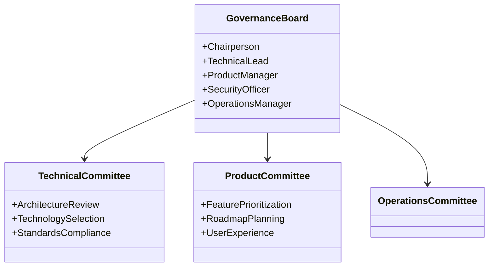
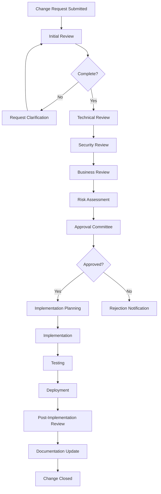
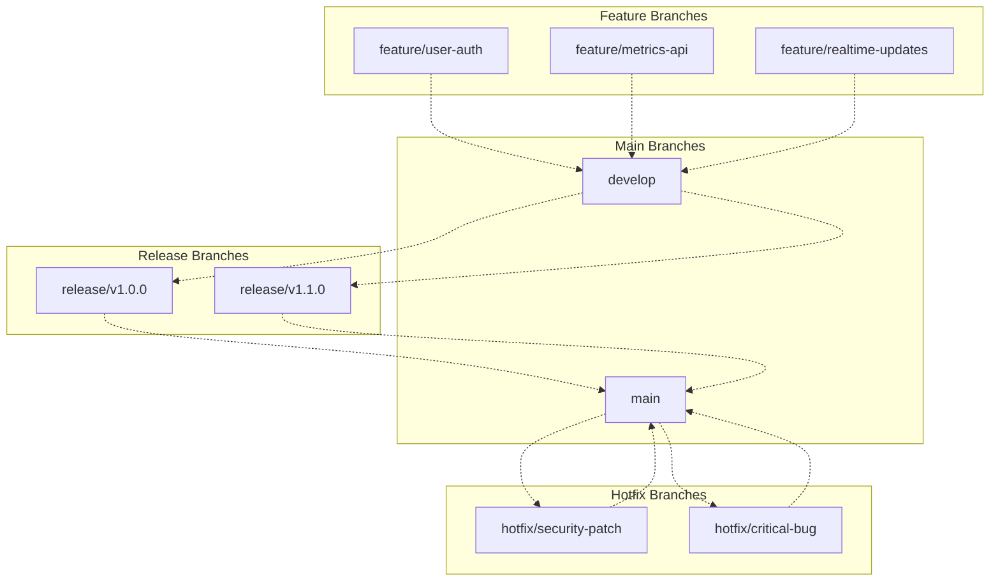
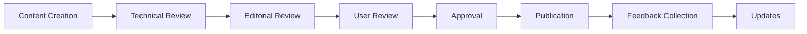
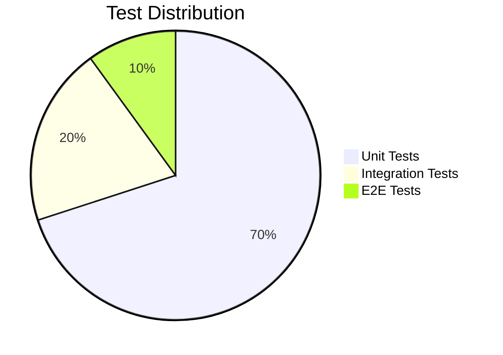
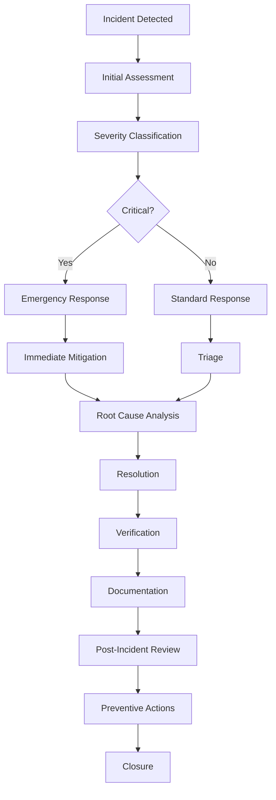
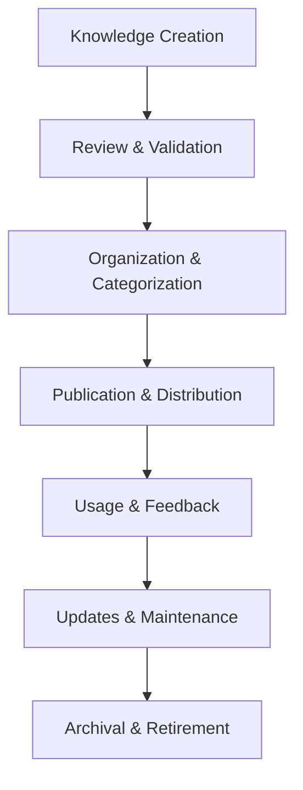

# Overlord PC Dashboard - Maintenance & Governance Handbook

> **Version:** 1.0.0  
> **Last Updated:** 2026-03-06  

## Table of Contents

1. [Governance Framework](#governance-framework)
2. [Change Management](#change-management)
3. [Version Control Strategy](#version-control-strategy)
4. [Release Management](#release-management)
5. [Documentation Standards](#documentation-standards)
6. [Quality Assurance](#quality-assurance)
7. [Compliance & Auditing](#compliance--auditing)
8. [Incident Management](#incident-management)
9. [Performance Management](#performance-management)
10. [Knowledge Management](#knowledge-management)

---

## 1. Governance Framework

### 1.1 Organizational Structure

#### Governance Board


#### Roles & Responsibilities

| Role | Responsibilities | Authority | Accountability |
|------|------------------|-----------|----------------|
| **Chief Architect** | System architecture, technical standards, technology selection | Architecture decisions, design reviews | System scalability, maintainability |
| **Product Manager** | Product vision, feature prioritization, user experience | Product roadmap, feature approval | User satisfaction, product success |
| **Security Officer** | Security policies, compliance, risk management | Security decisions, audit approval | Data protection, security incidents |
| **DevOps Lead** | Deployment, operations, infrastructure | Deployment decisions, infrastructure changes | System availability, performance |
| **Development Lead** | Code quality, development standards, team coordination | Code reviews, technical debt decisions | Code quality, development velocity |

### 1.2 Decision Making Process

#### Architecture Decision Records (ADRs)
```yaml
# Example ADR
id: 001
title: Microservices vs Monolithic Architecture
decision_date: 2026-01-15
status: accepted
context: |
  The system needs to scale to support 10,000+ concurrent users
  with real-time updates and complex integrations.
  
  Options considered:
  - Monolithic architecture: Simpler, faster development
  - Microservices: Scalable, independent deployment
  - Serverless: Cost-effective, auto-scaling

decision: Microservices architecture
rationale: |
  - Independent scaling of services
  - Technology diversity (different languages for different services)
  - Fault isolation (one service failure doesn't affect others)
  - Team autonomy (different teams can work independently)
  
  Trade-offs:
  - Increased operational complexity
  - Network latency between services
  - Distributed transaction challenges
  
  Alternatives rejected:
  - Monolithic: Would become a bottleneck at scale
  - Serverless: Cold start issues with real-time requirements

consequences: |
  - Need for service discovery and API gateway
  - Distributed tracing and monitoring requirements
  - Increased testing complexity
  - Need for DevOps expertise
```

---

## 2. Change Management

### 2.1 Change Request Process

#### Change Request Form
```yaml
change_request:
  id: unique_identifier
  title: brief_description
  type: [feature|bugfix|refactor|security|infrastructure]
  priority: [low|medium|high|critical]
  submitter: user_id
  date_submitted: timestamp
  proposed_change: detailed_description
  business_impact: [impact_analysis]
  risk_assessment: [risk_analysis]
  rollback_plan: [rollback_procedure]
  dependencies: [related_changes]
  estimated_effort: hours
  affected_components: [components_list]
  testing_requirements: [test_cases]
  approval_status: [pending|approved|rejected|deferred]
  approvers: [approver_ids]
  approval_date: timestamp
  implementation_deadline: timestamp
```

#### Change Approval Workflow


### 2.2 Emergency Change Procedure

#### Emergency Change Checklist
```markdown
# Emergency Change Procedure

## Immediate Actions (0-15 minutes)
- [ ] Assess severity and impact
- [ ] Notify stakeholders
- [ ] Document initial findings
- [ ] Establish emergency communication channel

## Analysis (15-60 minutes)
- [ ] Identify root cause
- [ ] Evaluate potential solutions
- [ ] Assess risks of each solution
- [ ] Determine rollback options

## Decision Making (60-120 minutes)
- [ ] Convene emergency meeting
- [ ] Present analysis to stakeholders
- [ ] Vote on proposed solution
- [ ] Document decision rationale

## Implementation (120+ minutes)
- [ ] Execute change with full monitoring
- [ ] Maintain detailed logs
- [ ] Prepare for immediate rollback if needed
- [ ] Communicate progress to stakeholders

## Post-Implementation (within 24 hours)
- [ ] Conduct post-mortem analysis
- [ ] Update incident documentation
- [ ] Review emergency procedures
- [ ] Schedule follow-up meeting
```

---

## 3. Version Control Strategy

### 3.1 Branching Strategy

#### Git Flow Implementation


#### Branch Naming Conventions
```yaml
# Branch naming conventions
feature: feature/[description]-[feature_name]
example: feature/user-authentication-jwt

bugfix: fix/[description]-[issue_number]
example: fix/database-connection-issue-1234

refactor: refactor/[description]-[component]
example: refactor/metrics-service-optimization

hotfix: hotfix/[description]-[severity]
example: hotfix/security-vulnerability-critical

release: release/v[Major].[Minor].[Patch]
example: release/v1.2.3
```

### 3.2 Versioning Strategy

#### Semantic Versioning
```yaml
version: Major.Minor.Patch

Major version: Breaking changes
- API changes that are not backward compatible
- Major feature additions
- Architecture changes

Minor version: New features
- New functionality that is backward compatible
- Non-breaking improvements
- New API endpoints

Patch version: Bug fixes
- Backward compatible bug fixes
- Security patches
- Performance improvements
```

#### Version Release Notes
```yaml
release_notes:
  version: 1.2.3
  release_date: 2026-03-01
  type: minor
  highlights:
    - "Added real-time system monitoring"
    - "Improved dashboard performance by 40%"
    - "Enhanced security with two-factor authentication"
  breaking_changes:
    - "API endpoint /systems/metrics changed to /metrics/systems"
    - "Removed deprecated authentication method"
  new_features:
    - "Real-time WebSocket updates"
    - "Advanced filtering and search"
    - "Mobile-responsive design"
  bug_fixes:
    - "Resolved memory leak in metrics collection"
    - "Fixed authentication timeout issues"
    - "Corrected timezone handling in reports"
  deprecations:
    - "Legacy API v1 will be removed in v2.0.0"
  known_issues:
    - "Mobile app may experience delays on slow networks"
    - "Large data exports may time out for very large datasets"
```

---

## 4. Release Management

### 4.1 Release Process

#### Release Checklist
```markdown
# Release Preparation Checklist

## Pre-Release (1 week before)
- [ ] Complete feature development
- [ ] All tests passing
- [ ] Documentation updated
- [ ] Performance benchmarks completed
- [ ] Security audit completed
- [ ] Backup systems verified

## Release Candidate (3 days before)
- [ ] Build release candidate
- [ ] Run integration tests
- [ ] Performance regression testing
- [ ] Security vulnerability scanning
- [ ] User acceptance testing

## Release Preparation (1 day before)
- [ ] Final build verification
- [ ] Rollback procedures tested
- [ ] Communication plan ready
- [ ] Support team notified
- [ ] Monitoring systems verified

## Release Day
- [ ] Deploy to staging environment
- [ ] Final verification
- [ ] Deploy to production
- [ ] Monitor system health
- [ ] Verify critical functionality

## Post-Release (24 hours after)
- [ ] Monitor for issues
- [ ] Collect user feedback
- [ ] Performance analysis
- [ ] Update documentation
- [ ] Schedule retrospective
```

#### Release Automation
```yaml
# Release automation
release:
  stages:
    build:
      steps:
        - checkout_code
        - install_dependencies
        - build_application
        - run_tests
        - create_artifacts
    
    test:
      steps:
        - integration_tests
        - performance_tests
        - security_tests
        - user_acceptance_tests
    
    deploy:
      steps:
        - deploy_to_staging
        - verify_deployment
        - run_staging_tests
        - deploy_to_production
        - monitor_health
    
    verify:
      steps:
        - health_checks
        - performance_monitoring
        - user_feedback_collection
        - rollback_preparation
```

### 4.2 Release Communication

#### Release Communication Plan
```yaml
communication:
  stakeholders:
    development_team:
      channels: [slack, email, github]
      frequency: real-time
      content: technical_details, issues, blockers
    
    product_team:
      channels: [email, meetings]
      frequency: daily_updates, release_notes
      content: features, timelines, business_impact
    
    management:
      channels: [email, reports]
      frequency: weekly, release_summary
      content: progress, risks, business_value
    
    customers:
      channels: [email, blog, documentation]
      frequency: release_announcements, changelogs
      content: new_features, improvements, known_issues
    
    support_team:
      channels: [slack, knowledge_base]
      frequency: release_preparation, issue_tracking
      content: troubleshooting, common_questions
```

---

## 5. Documentation Standards

### 5.1 Documentation Types

#### Required Documentation
```yaml
documentation_types:
  architecture:
    purpose: System design and technical decisions
    audience: Developers, architects, technical leads
    format: markdown, diagrams, ADRs
    frequency: as-needed, major changes
    
  development:
    purpose: Development guidelines and best practices
    audience: Developers, contributors
    format: markdown, code examples, tutorials
    frequency: ongoing updates
    
  deployment:
    purpose: Deployment procedures and operations
    audience: DevOps, system administrators
    format: markdown, scripts, configuration files
    frequency: as-needed, environment changes
    
  user:
    purpose: User guides and tutorials
    audience: End users, customers
    format: markdown, screenshots, videos
    frequency: feature releases, user feedback
    
  api:
    purpose: API documentation and specifications
    audience: Developers, third-party integrators
    format: OpenAPI, markdown, examples
    frequency: API changes, new endpoints
    
  operations:
    purpose: Operational procedures and runbooks
    audience: Support team, operations staff
    format: markdown, checklists, scripts
    frequency: process changes, new procedures
```

#### Documentation Standards
```yaml
documentation_standards:
  structure:
    title: H1
    introduction: H2
    sections: H2, H3, H4
    code: fenced blocks with language
    examples: numbered lists or code blocks
    
  formatting:
    code: consistent indentation, syntax highlighting
    links: descriptive text, external links in new tabs
    images: alt text, captions, responsive sizing
    tables: consistent headers, striped rows
    
  quality:
    accuracy: verified against current implementation
    completeness: covers all user scenarios
    clarity: plain language, minimal jargon
    consistency: uniform terminology, style
    
  review:
    technical_review: subject matter expert
    editorial_review: documentation specialist
    user_review: target audience representative
    approval: documentation lead
```

### 5.2 Documentation Management

#### Documentation Workflow


#### Documentation Tools
```yaml
documentation_tools:
  authoring:
    markdown: VS Code, Typora, Obsidian
    diagrams: Mermaid, draw.io, Lucidchart
    collaboration: GitHub, GitLab, Confluence
    
  publishing:
    static_sites: MkDocs, Docusaurus, GitBook
    wikis: GitHub Wiki, GitLab Wiki
    knowledge_bases: Confluence, Notion, Zendesk
    
  quality:
    grammar: Grammarly, LanguageTool
    spell_check: cspell, spellcheck
    accessibility: axe, WAVE
    
  analytics:
    usage: Google Analytics, Hotjar
    feedback: surveys, comments, ratings
    search: Algolia, Elasticsearch
```

---

## 6. Quality Assurance

### 6.1 Testing Strategy

#### Testing Pyramid


#### Test Categories
```yaml
test_categories:
  unit_tests:
    purpose: Individual component testing
    scope: Functions, classes, modules
    tools: pytest, Jest, JUnit
    coverage_target: 80%
    frequency: on-commit, pull-request
    
  integration_tests:
    purpose: Component interaction testing
    scope: API endpoints, database operations
    tools: pytest, Supertest, Postman
    coverage_target: 100% critical paths
    frequency: nightly, release-candidate
    
  e2e_tests:
    purpose: Complete user journey testing
    scope: User workflows, critical business processes
    tools: Cypress, Selenium, Playwright
    coverage_target: 90% critical user journeys
    frequency: release, scheduled
    
  performance_tests:
    purpose: System performance validation
    scope: Load testing, stress testing, scalability
    tools: JMeter, k6, Gatling
    coverage_target: 95% expected load
    frequency: release, capacity planning
    
  security_tests:
    purpose: Security vulnerability assessment
    scope: Authentication, authorization, data protection
    tools: OWASP ZAP, Burp Suite, SonarQube
    coverage_target: 100% security requirements
    frequency: release, scheduled, after changes
    
  usability_tests:
    purpose: User experience validation
    scope: Interface design, user workflows
    tools: User testing, heatmaps, analytics
    coverage_target: 80% user scenarios
    frequency: feature-complete, release
```

### 6.2 Quality Metrics

#### Quality KPIs
```yaml
quality_metrics:
  code_quality:
    cyclomatic_complexity: <10 average
    code_coverage: >80%
    technical_debt: <5 days
    bug_density: <1 bug per 1000 lines
    
  test_quality:
    test_pass_rate: >95%
    test_execution_time: <10 minutes
    flaky_tests: <1%
    test_maintainability: A grade
    
  deployment_quality:
    deployment_frequency: >5 times/week
    lead_time: <1 day
    change_failure_rate: <15%
    mean_time_to_recovery: <1 hour
    
  user_quality:
    user_satisfaction: >4.5/5
    task_success_rate: >90%
    error_rate: <2%
    adoption_rate: >70%
```

---

## 7. Compliance & Auditing

### 7.1 Compliance Framework

#### Regulatory Compliance
```yaml
compliance_standards:
  gdpr:
    scope: Data protection, privacy rights
    requirements:
      - data_minimization
      - purpose_limitation
      - storage_limitation
      - integrity_confidentiality
      - accountability
    audit_frequency: annual
    
  soc2:
    scope: Security, availability, processing integrity
    requirements:
      - security_controls
      - availability_monitoring
      - processing_integrity
      - confidentiality
      - privacy
    audit_frequency: annual
    
  hipaa:
    scope: Healthcare data protection
    requirements:
      - privacy_rules
      - security_rules
      - breach_notification
      - patient_rights
    audit_frequency: bi-annual
    
  iso27001:
    scope: Information security management
    requirements:
      - risk_management
      - security_policies
      - asset_management
      - access_control
      - compliance
    audit_frequency: annual
```

#### Internal Compliance
```yaml
internal_compliance:
  coding_standards:
    requirements:
      - consistent_style
      - documentation
      - error_handling
      - security_practices
    audit_frequency: monthly
    
  documentation_standards:
    requirements:
      - completeness
      - accuracy
      - accessibility
      - version_control
    audit_frequency: quarterly
    
  testing_standards:
    requirements:
      - coverage_minimums
      - test_quality
      - automation
      - regression_testing
    audit_frequency: monthly
    
  deployment_standards:
    requirements:
      - consistency
      - rollback_capability
      - monitoring
      - documentation
    audit_frequency: monthly
```

### 7.2 Audit Procedures

#### Audit Checklist
```markdown
# Compliance Audit Checklist

## Pre-Audit (1 week before)
- [ ] Notify stakeholders
- [ ] Prepare audit scope
- [ ] Gather documentation
- [ ] Schedule interviews
- [ ] Set up audit environment

## Documentation Review
- [ ] Architecture documents
- [ ] Code documentation
- [ ] API specifications
- [ ] Deployment procedures
- [ ] Security policies

## Technical Assessment
- [ ] Code quality analysis
- [ ] Security vulnerability scan
- [ ] Performance benchmarks
- [ ] Backup verification
- [ ] Disaster recovery test

## Process Review
- [ ] Development workflow
- [ ] Testing procedures
- [ ] Change management
- [ ] Incident response
- [ ] Knowledge management

## Compliance Verification
- [ ] Regulatory requirements
- [ ] Internal policies
- [ ] Industry standards
- [ ] Best practices
- [ ] Legal obligations

## Post-Audit (1 week after)
- [ ] Analyze findings
- [ ] Prepare report
- [ ] Present results
- [ ] Create action plan
- [ ] Follow-up schedule
```

---

## 8. Incident Management

### 8.1 Incident Classification

#### Incident Severity Levels
```yaml
incident_severity:
  critical:
    description: System-wide outage, data loss, security breach
    impact: All users, business operations
    response_time: 15 minutes
    escalation: 30 minutes
    resolution_target: 4 hours
    
  high:
    description: Major functionality broken, significant user impact
    impact: Large user group, critical features
    response_time: 1 hour
    escalation: 2 hours
    resolution_target: 12 hours
    
  medium:
    description: Partial functionality broken, moderate user impact
    impact: Medium user group, important features
    response_time: 4 hours
    escalation: 8 hours
    resolution_target: 24 hours
    
  low:
    description: Minor functionality broken, limited user impact
    impact: Small user group, non-critical features
    response_time: 24 hours
    escalation: 48 hours
    resolution_target: 72 hours
```

#### Incident Types
```yaml
incident_types:
  security_breach:
    severity: critical
    category: security
    examples: [data_breach, unauthorized_access, malware]
    response_team: security
    
  service_disruption:
    severity: high
    category: availability
    examples: [outage, downtime, performance_degradation]
    response_team: devops
    
  data_loss:
    severity: critical
    category: data_integrity
    examples: [corruption, deletion, backup_failure]
    response_team: data
    
  performance_issue:
    severity: medium
    category: performance
    examples: [slow_response, timeout, resource_exhaustion]
    response_team: engineering
    
  usability_issue:
    severity: low
    category: user_experience
    examples: [ui_bug, workflow_issue, accessibility_problem]
    response_team: product
```

### 8.2 Incident Response

#### Incident Response Process


#### Incident Response Team
```yaml
incident_response_team:
  roles:
    incident_commander:
      responsibilities: [overall_coordination, decision_making]
      skills: [leadership, technical_knowledge, communication]
    
    technical_lead:
      responsibilities: [technical_analysis, solution_implementation]
      skills: [system_architecture, debugging, problem_solving]
    
    communications_officer:
      responsibilities: [stakeholder_communication, status_updates]
      skills: [writing, public_relations, calm_under_pressure]
    
    scribe:
      responsibilities: [documentation, timeline_creation, action_items]
      skills: [attention_to_detail, writing, organization]
    
    subject_matter_expert:
      responsibilities: [technical_guidance, impact_assessment]
      skills: [domain_knowledge, system_expertise, analysis]
```

---

## 9. Performance Management

### 9.1 Performance Monitoring

#### Key Performance Indicators (KPIs)
```yaml
performance_kpis:
  availability:
    metric: uptime_percentage
    target: 99.9%
    measurement: (total_time - downtime) / total_time
    
  response_time:
    metric: p95_response_time
    target: <2 seconds
    measurement: 95th percentile of response times
    
  throughput:
    metric: requests_per_second
    target: >1000
    measurement: average requests per second
    
  error_rate:
    metric: error_percentage
    target: <1%
    measurement: (failed_requests / total_requests) * 100
    
  user_satisfaction:
    metric: satisfaction_score
    target: >4.5/5
    measurement: user_survey_results
    
  deployment_frequency:
    metric: deployments_per_week
    target: >5
    measurement: number of successful deployments
    
  lead_time:
    metric: time_from_commit_to_deploy
    target: <1 day
    measurement: average deployment lead time
```

#### Performance Dashboards
```json
{
  "dashboard": {
    "title": "System Performance Overview",
    "panels": [
      {
        "title": "Availability",
        "type": "stat",
        "target": "uptime_percentage",
        "thresholds": {
          "warning": 99.5,
          "critical": 99.0
        }
      },
      {
        "title": "Response Time",
        "type": "graph",
        "target": "p95_response_time",
        "unit": "seconds"
      },
      {
        "title": "Throughput",
        "type": "graph",
        "target": "requests_per_second",
        "unit": "req/s"
      },
      {
        "title": "Error Rate",
        "type": "stat",
        "target": "error_percentage",
        "thresholds": {
          "warning": 1.0,
          "critical": 2.0
        }
      }
    ]
  }
}
```

### 9.2 Performance Optimization

#### Performance Improvement Process


#### Performance Optimization Techniques
```yaml
optimization_techniques:
  caching:
    types: [in_memory, distributed, browser, cdn]
    strategies: [ttl, invalidation, lazy_loading]
    tools: [redis, memcached, varnish]
    
  database:
    techniques: [indexing, query_optimization, partitioning]
    strategies: [read_replicas, connection_pooling, caching]
    tools: [pgbench, explain_analyze, slow_query_log]
    
  code:
    techniques: [algorithm_optimization, lazy_loading, memoization]
    strategies: [async_processing, batching, parallelization]
    tools: [profiling, benchmarking, static_analysis]
    
  infrastructure:
    techniques: [load_balancing, auto_scaling, content_delivery]
    strategies: [multi_region, edge_computing, serverless]
    tools: [kubernetes, cloud_services, cdn_providers]
    
  network:
    techniques: [compression, minification, http2]
    strategies: [cdn, edge_caching, connection_reuse]
    tools: [nginx, cloudflare, aws_cloudfront]
```

---

## 10. Knowledge Management

### 10.1 Knowledge Base Structure

#### Knowledge Categories
```yaml
knowledge_categories:
  architecture:
    topics: [design_patterns, system_architecture, technology_choices]
    audience: developers, architects, technical_leads
    format: diagrams, documents, decision_records
    
  development:
    topics: [coding_standards, best_practices, troubleshooting]
    audience: developers, contributors
    format: tutorials, examples, faqs
    
  deployment:
    topics: [procedures, configurations, troubleshooting]
    audience: devops, system_admins, support
    format: runbooks, scripts, checklists
    
  operations:
    topics: [monitoring, incident_response, maintenance]
    audience: support, operations, on_call
    format: runbooks, procedures, playbooks
    
  product:
    topics: [features, user_guides, release_notes]
    audience: users, customers, support
    format: guides, tutorials, documentation
    
  security:
    topics: [policies, procedures, compliance]
    audience: security_team, developers, administrators
    format: policies, guidelines, procedures
```

#### Knowledge Management Process


### 10.2 Knowledge Sharing

#### Knowledge Sharing Methods
```yaml
knowledge_sharing:
  documentation:
    types: [technical_docs, user_guides, api_docs]
    tools: [markdown, wikis, knowledge_bases]
    frequency: ongoing, updates
    
  training:
    types: [onboarding, workshops, webinars]
    audience: new_hires, teams, customers
    frequency: scheduled, as_needed
    
  mentoring:
    types: [pair_programming, code_reviews, brown_bags]
    participants: [senior_junior, cross_team]
    frequency: regular, ad_hoc
    
  communities:
    types: [slack_channels, forums, meetups]
    topics: [technical, product, support]
    frequency: ongoing, events
    
  conferences:
    types: [presentations, workshops, lightning_talks]
    audience: internal, external, customers
    frequency: annual, bi_annual
```

---

## Conclusion

This maintenance and governance handbook provides comprehensive guidelines for ensuring the long-term success and sustainability of the Overlord PC Dashboard. By following these governance principles, change management procedures, and quality assurance practices, organizations can maintain a high-quality, secure, and reliable system.

**Next Steps:**
1. Establish governance board and committees
2. Implement change management process
3. Set up documentation standards and tools
4. Establish quality metrics and monitoring
5. Schedule regular compliance audits
6. Create knowledge management system

---

*Maintenance & Governance handbook version: 1.0.0 | Last updated: 2026-03-06*